# Redis
## 安装配置

>[!tip] 注意
> 基于 Windows + WSL

### 第一步：安装 wsl
### 第二步：安装 Redis  

1. 打开 wsl
2. [Install Redis on Windows](https://redis.io/docs/latest/operate/oss_and_stack/install/archive/install-redis/install-redis-on-windows/)
### 第三步：配置

用 vim 编辑器进入配置文件

```Shell
sudo vim /etc/redis/redis.conf
```

>[!tip]
>修改一下配置：
>1. 允许访问的地址，默认是127.0.0.1，会导致只能在本地访问。修改为0.0.0.0则可以在任意IP访问，生产环境不要设置为0.0.0.0
>```shell
>bind 0.0.0.0
>```
>2. 守护进程，修改为yes后即可后台运行
>```shell
>daemonize yes 
>```
>3. 密码，设置后访问Redis必须输入密码
>```shell
>requirepass 101024
>```
>4. 日志文件，默认为空，不记录日志，可以指定日志文件名
>```shell
>logfile "redis.log"
>```

设置开机自启（只有在打开 WSL 时启动Redis）

>[!tip]
>1. 进入配置文件
>```Shell
>nano ~/.bashrc
>```
>2. 添加 Redis 启动命令
>```Shell
># Start Redis server if not already running
>if ! pgrep -x redis-server > /dev/null; then
>sudo service redis-server start
>fi
>```
>3. 保存并退出
>`Ctrl+O` -> `Enter` -> `Ctrl+X`
>
>4. 生效命令
>```Shell
>source ~/.bashrc

检查 Redis 是否运行：

```Shell
sudo service redis-server status
```

## Redis 客户端

### CLI

进入 Windows WSL2：

```shell
redis-cli -a 101024
```

### GUI

下载 Another Redis Desktop Manager

获取 WSL 动态 IP（**每次启动 WSL 都会更新 IP**）

```Shell
ip addr show eth0 | grep -oP 'inet\s+\K[\d.]+'
```

进入客户端连接

## 序列化

#TODO
## 连接池

#TODO

## 缓存

### 添加缓存

Service 层代码：
```java
@Override  
public Result queryById(Long id) {  
    String key = CACHE_SHOP_KEY + id;  
    String shopJson = stringRedisTemplate.opsForValue().get(key);  
    if (StrUtil.isNotBlank(shopJson)) {  
        Shop shop = JSONUtil.toBean(shopJson, Shop.class);  
        return Result.ok(shop);  
    }  
    Shop shop = getById(id);  
    if (shop == null) {  
        return Result.fail("商铺不存在");  
    }  
    stringRedisTemplate.opsForValue().set(key, JSONUtil.toJsonStr(shop));  
    return Result.ok(shop);  
}
```

### 缓存更新 


>高一致性需求：采用先**操作数据库，再删除缓存**的方法


Service 层代码：
```java
@Override  
@Transactional  
public Result update(Shop shop) {  
    Long id = shop.getId();  
    if (id == null) {  
        return Result.fail("店铺id不能为空");  
    }  
    updateById(shop);  
    stringRedisTemplate.delete(CACHE_SHOP_KEY + id);  
    return Result.ok();  
}
```

### 缓存穿透

**缓存穿透**指的是当用户或攻击者请求一个既不在缓存中也不在数据库中的数据时，每次请求都会穿透缓存，直接打到数据库上。如果这种请求量很大，数据库就会不堪重负。

1. 缓存空对象
2. 布隆过滤


```java
@Override  
public Result queryById(Long id) {  
    String key = CACHE_SHOP_KEY + id;  
    String shopJson = stringRedisTemplate.opsForValue().get(key);  
    if (StrUtil.isNotBlank(shopJson)) {  
        Shop shop = JSONUtil.toBean(shopJson, Shop.class);  
        return Result.ok(shop);  
    }  
    if (shopJson != null) {  
        return Result.fail("店铺信息不存在");  
    }  
    Shop shop = getById(id);  
    if (shop == null) {  
        stringRedisTemplate.opsForValue().set(key, "", CACHE_NULL_TTL, TimeUnit.MINUTES  
        );  
        return Result.fail("店铺不信息存在");  
    }  
    stringRedisTemplate.opsForValue().set(key, JSONUtil.toJsonStr(shop), CACHE_SHOP_TTL, TimeUnit.MINUTES);  
    return Result.ok(shop);  
}
```
- `StrUtil.isNotBlank(shopJson)`：检查字符串是否**非空（not null）**、**非空白（not empty）且不只包含空格符**（存在）
- `if (shopJson != null)`：`shopJson` 要么是空字符串 `""`，要么只包含空格（不存在但已缓存）
- `if (shop == null)`：数据库查询结果也为 `null`，说明这个店铺确实不存在（不存在且未缓存）

### 缓存雪崩

**解决方案：**
- 给不同的Key的TTL添加随机值
- 利用Redis集群提高服务的可用性
- 给缓存业务添加降级限流策略
- 给业务添加多级缓存


>[!tip] 具体实现
>利用 SpringCloud 中的各种安全方案解决

### 缓存击穿


>解决方案一：互斥锁


>解决方案二：逻辑过期


>解决方案对比


一致性和可用性之间要做出抉择

>双重检查锁定（双检）

**先检查，后（加锁）再检查，最后（如果仍然需要）才重建缓存**

1. 第一次检查
	- **目的**：**减少锁的竞争，提高性能**
	- 解释：在大多数情况下，缓存数据是有效的
2. 获取锁：
	- **目的**：**确保只有一个线程能进入关键区，避免重复操作和数据不一致**
	- 解释： 第一次检查发现数据已逻辑过期时，才尝试获取分布式锁
3. 第二次检查（加锁后）
	- **目的**：**防止重复重建，解决“双重检查问题”**
	- 解释：A 异步重建后释放锁，B 可能会获得锁，如果不进行第二次检查，就会无条件开始又一次缓存重建，造成资源浪费
4. 重建缓存（如果仍然需要）
	- **目的**：**更新过期数据**
	- 解释：经过两次检查，并确认数据确实需要更新时，才触发真正的缓存重建操作


>互斥锁

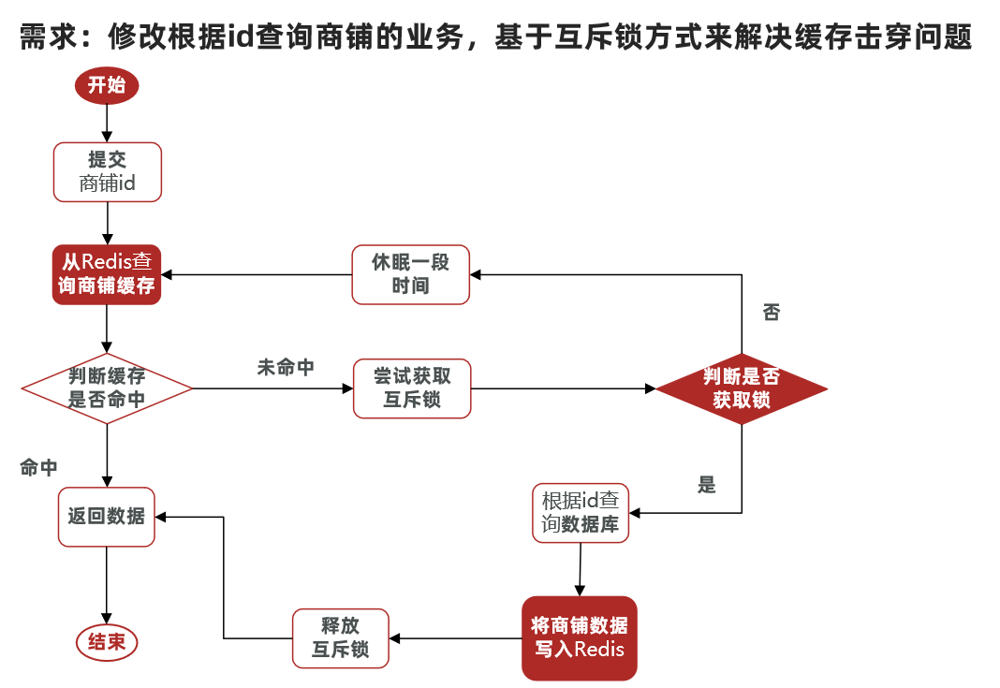
```java
@Override  
public Result queryById(Long id) {  
    Shop shop = queryWithMutex(id);  
    if (shop == null) {  
        return Result.fail("店铺不存在");  
    }  
    return Result.ok(shop);  
}  
  
public Shop queryWithMutex(Long id) {  
    String key = CACHE_SHOP_KEY + id;  
    // 1. 从Redis查询商铺缓存
    String shopJson = stringRedisTemplate.opsForValue().get(key); 
    // 2. 判断是否存在 
    if (StrUtil.isNotBlank(shopJson)) {  
	    // 3. 存在，直接返回
        return JSONUtil.toBean(shopJson, Shop.class);  
    }  
    // 判断命中的是否是空值
    if (shopJson != null) {  
	    // 返回一个错误信息
        return null;  
    }  
    // 4. 实现缓存重建
    String lockKey = "lock:shop:" + id;  
    Shop shop = null;  
    try {  
	    // 4.1 获取互斥锁
        boolean isLock = tryLock(lockKey);  
        // 4.2 判断是否获取成功
        if (!isLock) {  
	        // 4.3 失败，则休眠并重试
            Thread.sleep(50);  
            return queryWithMutex(id);  
        }  
        // 4.4 成功，进行双重检查
        // 再次从Redis查询商铺缓存
        shopJson = stringRedisTemplate.opsForValue().get(key);  
        // 再次判断是否存在
        if (StrUtil.isNotBlank(shopJson)) {  
	        // 存在，释放锁并返回
            return JSONUtil.toBean(shopJson, Shop.class);  
        }  
        // 再次判断命中的是否是空值（防止在这段时间内有其他线程写入了空值）
        if (shopJson != null) {  
	        // 返回一个错误信息
            return null;  
        }  
        // 4.5 不存在，根据id查询数据库
        shop = getById(id);  
        // 4.6 数据库中不存在，将空值写入Redis
        if (shop == null) {  
            stringRedisTemplate.opsForValue().set(key, "", CACHE_NULL_TTL, TimeUnit.MINUTES  
            );  
            return null;  
        }  
        // 4.7 数据库中存在，写入Redis
        stringRedisTemplate.opsForValue().set(key, JSONUtil.toJsonStr(shop), CACHE_SHOP_TTL, TimeUnit.MINUTES);  
    } catch (InterruptedException e) {  
        throw new RuntimeException(e);  
    } finally {  
	    // 4.8 释放锁
        unlock(lockKey);  
    }  
    return shop;  
}  
  
private boolean tryLock(String key) {  
    Boolean flag = stringRedisTemplate.opsForValue().setIfAbsent(key, "1", 10, TimeUnit.SECONDS);  
    return BooleanUtil.isTrue(flag);  
}  
  
private void unlock(String key) {  
    stringRedisTemplate.delete(key);  
}
```

>逻辑过期


```java
@Override  
public Result queryById(Long id) {  
    // 1. 互斥锁解决缓存击穿  
    //Shop shop = queryWithMutex(id);  
  
    // 2. 逻辑过期解决缓存击穿  
    Shop shop = queryWithLogicalExpire(id);  
    if (shop == null) {  
        return Result.fail("店铺不存在");  
    }  
    return Result.ok(shop);  
}
// 创建了一个固定大小为 10 的线程池:用于异步执行缓存重建任务
private static final ExecutorService CACHE_REBUILD_EXECUTOR = Executors.newFixedThreadPool(10);

public Shop queryWithLogicalExpire(Long id) {  
    String key = CACHE_SHOP_KEY + id;  
    // 1. 从 Redis 查询商铺缓存数据
    String shopJson = stringRedisTemplate.opsForValue().get(key); 
    // 2. 判断 Redis 中是否存在这个键的数据 
    if (StrUtil.isBlank(shopJson)) {  
        return null;  
    }  
    // 3. 如果 Redis 中有数据，则反序列化为 RedisData 对象
    RedisData redisData = JSONUtil.toBean(shopJson, RedisData.class);  
    // 4. 获取 RedisData 中的实际店铺数据和逻辑过期时间
    JSONObject data = (JSONObject) redisData.getData();  
    Shop shop = JSONUtil.toBean(data, Shop.class);  
    LocalDateTime expireTime = redisData.getExpireTime();  
    // 5. 判断当前缓存数据是否逻辑过期
    if (expireTime.isAfter(LocalDateTime.now())) {  
	    // 5.1 未过期：如果逻辑过期时间在当前时间之后，说明数据仍然有效
        return shop;  
    }  
    // 6. 已过期：如果数据已逻辑过期，需要尝试重建缓存
    String lockKey = LOCK_SHOP_KEY + id;  
    // 7. 尝试获取互斥锁（防止多个线程同时重建同一个缓存）
    boolean isLock = tryLock(lockKey);  
    // 8. 判断是否成功获取锁
    if (isLock) {  
	    // 8.1 成功获取锁：执行“双重检查”
        shopJson = stringRedisTemplate.opsForValue().get(key);  
        if (StrUtil.isNotBlank(shopJson)) {  
            redisData = JSONUtil.toBean(shopJson, RedisData.class);  
            if (redisData.getExpireTime().isAfter(LocalDateTime.now())) {  
                unlock(lockKey);  
                return JSONUtil.toBean((JSONObject) redisData.getData(), Shop.class);  
            }  
        }  
        // 8.2 如果双重检查后，缓存仍然是逻辑过期（或为空），则提交异步任务进行缓存重建
        CACHE_REBUILD_EXECUTOR.submit(() -> {  
            try {  
                saveShop2Redis(id, 20L);  
            } catch (Exception e) {  
                throw new RuntimeException(e);  
            } finally {  
                unlock(lockKey);  
            }  
        });  
    }  
    // 9. 返回旧数据：无论是否获取到锁，或者是否触发了异步重建，都会立即返回当前缓存中的 shop 对象。
    // 这保证了高可用性，用户不会因为缓存重建而等待。
    return shop;  
}

public void saveShop2Redis(Long id, Long expireSeconds) {  
    Shop shop = getById(id);  
    RedisData redisData = new RedisData();  
    redisData.setData(shop);  
    redisData.setExpireTime(LocalDateTime.now().plusSeconds(expireSeconds));  
    stringRedisTemplate.opsForValue().set(CACHE_SHOP_KEY + id, JSONUtil.toJsonStr(redisData));  
}

private boolean tryLock(String key) {  
    Boolean flag = stringRedisTemplate.opsForValue().setIfAbsent(key, "1", 10, TimeUnit.SECONDS);  
    return BooleanUtil.isTrue(flag);  
}  
  
private void unlock(String key) {  
    stringRedisTemplate.delete(key);  
}
```

### 缓存穿透 vs 缓存击穿

>缓存穿透

**定义**
缓存穿透指的是查询一个**不存在的数据**，导致请求绕过缓存，直接访问数据库。由于这个数据永远不会被缓存，所以每次请求都会穿透缓存，直接到达数据库。

**发生原因**
通常是恶意攻击者通过大量查询不存在的数据，或者业务逻辑中存在一些罕见的查询条件导致。

**解决方案**
- 缓存空对象
- 布隆过滤

>缓存击穿

**定义**
缓存击穿指的是一个**热点数据**在缓存中**失效**的瞬间，大量的并发请求同时涌入，这些请求都无法从缓存中获取数据，从而全部打到数据库上。

**发生原因**
通常是由于某个**高并发访问的热点数据**的缓存**过期**了，而此时正好有大量请求访问这个数据。

**解决方案**
- 互斥锁
- 逻辑过期

>[!tip] 代码实现
>在设计和实现缓存策略时，通常会将**缓存穿透**和**缓存击穿**的解决方案**整合到一份代码中**，这样能更全面地提升系统的健壮性


## Lua 脚本

参考教程：[菜鸟教程](https://www.runoob.com/lua/lua-tutorial.html)


---
>[!tip] 接下来是 Redis 高级篇
## 分布式缓存

>单点 Redis 的问题


### Redis 持久化

#### RDB 持久化

RDB 全称 Redis Database Backup file（ Redis 数据备份文件），也被叫做 Redis 数据快照。简单来说就是把内存中的所有数据都记录到磁盘中。当 Redis 实例故障重启后，从磁盘读取快照文件，恢复数据。快照文件称为 RDB 文件，默认是保存在当前运行目录。

>执行时机

- 执行 `save` 命令
- 执行 `bgsave` 命令
- Redis 停机时
- 触发 RDB 条件时

>原理

bgsave 开始时会 fork 主进程得到子进程，子进程共享主进程的内存数据。完成 fork 后读取内存数据并写入 RDB 文件。
fork 采用的是 copy-on-write 技术：
- 当主进程执行读操作时，访问共享内存；
- 当主进程执行写操作时，则会拷贝一份数据，执行写操作。

>总结

RDB 方式 bgsave 的基本流程？
- fork 主进程得到一个子进程，共享内存空间
- 子进程读取内存数据并写入新的 RDB 文件
- 用新 RDB 文件替换旧的 RDB 文件

RDB 会在什么时候执行？save 60 1000代表什么含义？
- 默认是服务停止时
- 代表60秒内至少执行1000次修改则触发RDB

RDB 的缺点？
- RDB 执行间隔时间长，两次 RDB 之间写入数据有丢失的风险
- fork 子进程、压缩、写出 RDB 文件都比较耗时

#### AOF 持久化

>原理

AOF 全称为 Append Only File（追加文件）。Redis 处理的每一个写命令都会记录在 AOF 文件，可以看做是命令日志文件。

>配置策略


>AOF 文件重写

#### RDB vs AOF


### Redis 主从

#### 搭建主从集群

#TODO 见文档

#### 主从数据同步原理

>全量同步


master如何得知salve是第一次来连接呢？
- **Replication Id**：简称replid，是数据集的标记，id一致则说明是同一数据集。每一个master都有唯一的replid，slave则会继承master节点的replid
- **offset**：偏移量，随着记录在repl_baklog中的数据增多而逐渐增大。slave完成同步时也会记录当前同步的offset。如果slave的offset小于master的offset，说明slave数据落后于master，需要更新。
因此，**master判断一个节点是否是第一次同步的依据，就是看replid是否一致：**

完整流程：
- slave节点请求增量同步
- master节点判断replid，发现不一致，拒绝增量同步
- master将完整内存数据生成RDB，发送RDB到slave
- slave清空本地数据，加载master的RDB
- master将RDB期间的命令记录在repl_baklog，并持续将log中的命令发送给slave
- slave执行接收到的命令，保持与master之间的同步

>增量同步

主从第一次同步是全量同步，但如果 slave 重启后同步，则执行增量同步

#### 主从同步优化

- 在master中配置repl-diskless-sync yes启用无磁盘复制，避免全量同步时的磁盘IO。
- Redis 单节点上的内存占用不要太大，减少 RDB 导致的过多磁盘 IO
- 适当提高 repl_baklog 的大小，发现 slave 宕机时尽快实现故障恢复，尽可能避免全量同步
- 限制一个 master 上的 slave 节点数量，如果实在是太多 slave，则可以采用主-从-从链式结构，减少 master 压力


### Redis 哨兵


作用：
- **监控**：Sentinel 会不断检查您的master和slave是否按预期工作
- **自动故障恢复**：如果master故障，Sentinel会将一个slave提升为master。当故障实例恢复后也以新的master为主
- **通知**：Sentinel充当Redis客户端的服务发现来源，当集群发生故障转移时，会将最新信息推送给Redis的客户端

#### 原理

>监控原理


Sentinel基于心跳机制监测服务状态，每隔1秒向集群的每个实例发送ping命令：
- 主观下线：如果某sentinel节点发现某实例未在规定时间响应，则认为该实例**主观下线**。
- 客观下线：若超过指定数量（quorum）的sentinel都认为该实例主观下线，则该实例**客观下线**。quorum值最好超过Sentinel实例数量的一半。

>选举新的 master

一旦发现master故障，sentinel需要在salve中选择一个作为新的master，选择依据是这样的：
- 首先会判断slave节点与master节点断开时间长短，如果超过指定值（down-after-milliseconds * 10）则会排除该slave节点
- 然后判断slave节点的slave-priority值，越小优先级越高，如果是0则永不参与选举
- 如果slave-prority一样，则判断slave节点的offset值，越大说明数据越新，优先级越高
- 最后是判断slave节点的运行id大小，越小优先级越高。

>如何实现故障转移


当选出一个新的master后，该如何实现切换呢？
流程如下：
- sentinel给备选的slave1节点发送slaveof no one命令，让该节点成为master
- sentinel给所有其它slave发送slaveof 192.168.150.101 7002 命令，让这些slave成为新master的从节点，开始从新的master上同步数据。
- 最后，sentinel将故障节点标记为slave，当故障节点恢复后会自动成为新的master的slave节点

#### 搭建哨兵集群

#TODO 见文档

#### RedisTemplate

#TODO 见文档
### Redis 分片集群

主从和哨兵可以解决高可用、高并发读的问题。但是依然有两个问题没有解决：
- 海量数据存储问题
- 高并发写的问题
使用分片集群可以解决上述问题，分片集群特征：
- 集群中有多个master，每个master保存不同数据
- 每个master都可以有多个slave节点
- master之间通过ping监测彼此健康状态
- 客户端请求可以访问集群任意节点，最终都会被转发到正确节点

#### 搭建分片集群

#TODO 见文档

#### 散列插槽

Redis会把每一个master节点映射到0~16383共16384个插槽（hash slot）上，查看集群信息时就能看到：

数据key不是与节点绑定，而是与插槽绑定。redis会根据key的有效部分计算插槽值，分两种情况：
- key中包含"{}"，且“{}”中至少包含1个字符，“{}”中的部分是有效部分
- key中不包含“{}”，整个key都是有效部分

>总结

Redis如何判断某个key应该在哪个实例？
- 将16384个插槽分配到不同的实例
- 根据key的有效部分计算哈希值，对16384取余
- 余数作为插槽，寻找插槽所在实例即可
如何将同一类数据固定的保存在同一个Redis实例？
- 这一类数据使用相同的有效部分，例如key都以{typeId}为前缀

>插槽到底是什么？

**插槽（slot）就是一个逻辑上的抽象概念**，它**不能**直接对应到计算机上任何物理的、实体的东西。插槽本身不占用内存，也不存储数据。它更像是一个无形的“标签”或“编号”，用来对所有可能的键进行分类。

- **逻辑上**: 这是一个范围在 0 到 16383 的整数，代表了整个键空间（keyspace）的 16384 个分区。
- **物理上**: 它**没有**物理实体。它只是一个哈希算法 `CRC16(key) mod 16384` 的结果。当你计算出一个键属于哪个插槽时，这个插槽号只是一个数字。

**插槽（Slot）是 Redis 集群特有的概念**，**插槽机制**是为了解决分布式存储问题而设计的，它只存在于 **Redis 集群模式**下。

>不同插槽号之间的区别到底是什么？

不同插槽号之间**唯一的区别**，就是它们各自负责的**键的范围不同**。它们本身没有物理上的差异，但在**集群模式下**，它们有了实际的意义：
1. **数据归属**：不同的插槽号决定了特定的键应该由哪个 **Redis 节点**来负责存储。
2. **数据迁移**：在集群扩容或缩容时，Redis 移动的单位是**插槽**，而不是单个键。比如，需要增加一个节点，就将旧节点上的一部分插槽（比如从 1000 到 2000 号）迁移到新节点上。

*就像你给你的文件柜里每个抽屉都贴上了标签，比如“A-F”、“G-L”、“M-R”等等。这些标签本身没有任何物理实体，但它们决定了你应该把姓氏首字母是“C”的文件放进哪个抽屉。*

>插槽是用来装数据的吗？

插槽**不是**直接用来装数据的。它是一个逻辑概念，用来将整个键空间（keyspace）划分为 16384 个槽位。**实际的数据（也就是键值对）是存放在一个个的 Redis 节点（node）中的**。

>为什么是16384？

1. **方便集群扩展和缩减**
如果只有 3 个分区（对应 3 个 Redis 节点），当增加第四个节点时，就必须把其中一个节点的所有数据，或其中两个节点的部分数据，迁移到新的节点上。
这种方式的缺点很明显：
- **数据迁移不灵活**：你无法精细地控制迁移的粒度。例如，从一个节点迁移到另一个节点，你可能需要移动数百万甚至上亿个键，这会是一个非常耗时且对集群性能影响很大的操作。
- **数据迁移不均衡**：你很难保证数据在迁移后能均匀地分布在所有节点上。
有了 **16384 个插槽**，情况就完全不同了。当你要增加第四个节点时，你只需要从已有的节点上，**迁移一部分插槽**到新的节点上

比如，你可以从节点 A 迁移 1000 个插槽，从节点 B 迁移 1000 个插槽，从节点 C 迁移 1000 个插槽，总共 3000 个插槽到新节点 D。这个过程可以**分步进行，粒度非常小，而且能够保证数据在集群中高度均衡**。这种弹性是“按节点分区”模式无法比拟的。

2. **避免大节点数据迁移的开销**
在 Redis 集群中，**一个 Redis 节点可能管理着多个插槽**。当一个节点因为故障需要被替换时，它所负责的那些插槽可以被快速地重新分配给其他节点。由于插槽数量多，每个插槽里的数据相对较少（相比整个节点的数据），因此迁移的开销也相对较小。

3. **Redis 集群协议的考虑**
Redis 集群内部通过 Gossip 协议来同步集群状态。每个节点都需要向其他节点广播自己的状态，包括它所负责的插槽信息。
- Redis 官方解释中提到，如果插槽数量是 65536，那么心跳包（ping packet）的大小会非常大，因为它需要携带更多的插槽信息，这会增加网络负担。
- 16384 这个数字是在**插槽数量的灵活性**（方便扩缩容）和**网络通信开销**之间找到的一个平衡点。这个数值足以提供足够的灵活性，同时又不会让集群内部的通信变得臃肿。

总而言之，**16384 个插槽**是一种**解耦**的设计。它将“**数据分区**”这个逻辑概念从“**物理节点**”这个实体中分离了出来。
- **插槽**是数据分区的最小单位，它提供了精细的、可灵活调整的粒度。
- **Redis 节点**是物理的存储单位，它负责管理一组插槽。
这种设计使得 Redis 集群的扩容、缩容和故障恢复变得非常高效和优雅。
#### 集群伸缩

#TODO 见文档

#### 故障转移

>自动故障转移

当集群中有一个master宕机会发生什么呢？
1）首先是该实例与其它实例失去连接
2）然后是疑似宕机：

3）最后是确定下线，自动提升一个slave为新的master：

4）当7002再次启动，就会变为一个slave节点了：


>手动故障转移

利用cluster failover命令可以手动让集群中的某个master宕机，切换到执行cluster failover命令的这个slave节点，实现无感知的数据迁移。其流程如下：

这种failover命令可以指定三种模式：
- 缺省：默认的流程，如图1~6歩
- force：省略了对offset的一致性校验
- takeover：直接执行第5歩，忽略数据一致性、忽略master状态和其它master的意见

#### RedisTemplate

#TODO 访问分片集群（见文档）

## 多级缓存

#### 什么是多级缓存？

传统的缓存策略一般是请求到达Tomcat后，先查询Redis，如果未命中则查询数据库：

存在下面的问题：
- 请求要经过Tomcat处理，Tomcat的性能成为整个系统的瓶颈
- Redis缓存失效时，会对数据库产生冲击

多级缓存就是充分利用请求处理的每个环节，分别添加缓存，减轻Tomcat压力，提升服务性能：

- 浏览器访问静态资源时，优先读取浏览器本地缓存
- 访问非静态资源（ajax查询数据）时，访问服务端
- 请求到达Nginx后，优先读取Nginx本地缓存
- 如果Nginx本地缓存未命中，则去直接查询Redis（不经过Tomcat）
- 如果Redis查询未命中，则查询Tomcat
- 请求进入Tomcat后，优先查询JVM进程缓存
- 如果JVM进程缓存未命中，则查询数据库

在多级缓存架构中，Nginx内部需要编写本地缓存查询、Redis查询、Tomcat查询的业务逻辑，因此这样的nginx服务不再是一个**反向代理服务器**，而是一个编写**业务的Web服务器了**。

因此这样的业务Nginx服务也需要搭建集群来提高并发，再有专门的nginx服务来做反向代理：
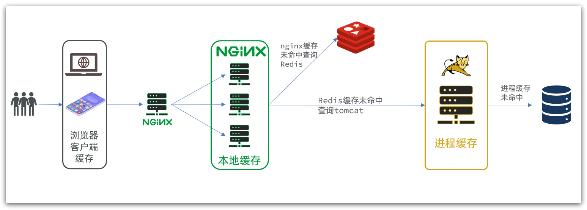
另外，我们的Tomcat服务将来也会部署为集群模式：


可见，多级缓存的关键有两个：
- 一个是在nginx中编写业务，实现nginx本地缓存、Redis、Tomcat的查询
- 另一个就是在Tomcat中实现JVM进程缓存
其中Nginx编程则会用到OpenResty框架结合Lua这样的语言

#### JVM 进程缓存

缓存在日常开发中启动至关重要的作用，由于是存储在内存中，数据的读取速度是非常快的，能大量减少对数据库的访问，减少数据库的压力。我们把缓存分为两类：
- 分布式缓存，例如Redis：
    - 优点：存储容量更大、可靠性更好、可以在集群间共享
    - 缺点：访问缓存有网络开销
    - 场景：缓存数据量较大、可靠性要求较高、需要在集群间共享
- 进程本地缓存，例如HashMap、GuavaCache：
    - 优点：读取本地内存，没有网络开销，速度更快
    - 缺点：存储容量有限、可靠性较低、无法共享
    - 场景：性能要求较高，缓存数据量较小

##### Caffeine

**Caffeine**是一个基于Java8开发的，提供了近乎最佳命中率的高性能的本地缓存库。目前Spring内部的缓存使用的就是Caffeine。
GitHub地址：[https://github.com/ben-manes/caffeine](https://github.com/ben-manes/caffeine)

>[!tip] 缓存使用的基本 API
>```java
>@Test
>void testBasicOps() {
>	// 构建cache对象
>	Cache<String, String> cache = Caffeine.newBuilder().build();
>	// 存数据
>	cache.put("gf", "迪丽热巴");
>	// 取数据
>	String gf = cache.getIfPresent("gf");
>	System.out.println("gf = " + gf);
>	// 取数据，包含两个参数：
>	// 参数一：缓存的key
>	// 参数二：Lambda表达式，表达式参数就是缓存的key，方法体是查询数据库的逻辑
>	// 优先根据key查询JVM缓存，如果未命中，则执行参数二的Lambda表达式
>	String defaultGF = cache.get("defaultGF", key -> {
>		// 根据key去数据库查询数据
>		return "柳岩";
>	});
>	System.out.println("defaultGF = " + defaultGF);
>}

>Caffeine 提供的三种缓存驱逐策略

- **基于容量**：设置缓存的数量上限
```java
// 创建缓存对象
Cache<String, String> cache = Caffeine.newBuilder()
    .maximumSize(1) // 设置缓存大小上限为 1
    .build();
```

- **基于时间**：设置缓存的有效时间
```java
// 创建缓存对象
Cache<String, String> cache = Caffeine.newBuilder()
    // 设置缓存有效期为 10 秒，从最后一次写入开始计时 
    .expireAfterWrite(Duration.ofSeconds(10)) 
    .build();
```

- - **基于引用**：设置缓存为软引用或弱引用，利用GC来回收缓存数据。性能较差，不建议使用。

注意：在默认情况下，当一个缓存元素过期的时候，Caffeine不会自动立即将其清理和驱逐。而是在一次读或写操作后，或者在空闲时间完成对失效数据的驱逐。

>实现

```java
@Configuration
public class CaffeineConfig {
	@Bean
	public Cache<Long, Item> itemCache(){
		return Caffeine.newBuilder()
			.initialCapacity(100)
			.maximumSize(10_000)
			.build();
	}
	@Bean
    public Cache<Long, ItemStock> stockCache(){
        return Caffeine.newBuilder()
                .initialCapacity(100)
                .maximumSize(10_000)
                .build();
    }
}
```

```java
@RestController
@RequestMapping("item")
public class ItemController {

    @Autowired
    private IItemService itemService;
    @Autowired
    private IItemStockService stockService;

    @Autowired
    private Cache<Long, Item> itemCache;
    @Autowired
    private Cache<Long, ItemStock> stockCache;
    
    // ...其它略
    
    @GetMapping("/{id}")
    public Item findById(@PathVariable("id") Long id) {
        return itemCache.get(id, key -> itemService.query()
                .ne("status", 3).eq("id", key)
                .one()
        );
    }

    @GetMapping("/stock/{id}")
    public ItemStock findStockById(@PathVariable("id") Long id) {
        return stockCache.get(id, key -> stockService.getById(key));
    }
}
```

#### Lua 语法入门

Nginx编程需要用到Lua语言，因此我们必须先入门Lua的基本语法。

>初识 Lua

Lua 是一种轻量小巧的脚本语言，用标准C语言编写并以源代码形式开放， 其设计目的是为了嵌入应用程序中，从而为应用程序提供灵活的扩展和定制功能。
官网：[https://www.lua.org/](https://www.lua.org/)

Lua经常嵌入到C语言开发的程序中，例如游戏开发、游戏插件等。
Nginx本身也是C语言开发，因此也允许基于Lua做拓展。

>数据类型

Lua中支持的常见数据类型包括：


另外，Lua提供了type()函数来判断一个变量的数据类型：

>声明变量

Lua声明变量的时候无需指定数据类型，而是用local来声明变量为局部变量：
```lua
-- 声明字符串，可以用单引号或双引号，
local str = 'hello'
-- 字符串拼接可以使用 ..
local str2 = 'hello' .. 'world'
-- 声明数字
local num = 21
-- 声明布尔类型
local flag = true
```

Lua中的table类型既可以作为数组，又可以作为Java中的map来使用。数组就是特殊的table，key是数组角标而已：
```lua
-- 声明数组 ，key为角标的 table
local arr = {'java', 'python', 'lua'}
-- 声明table，类似java的map
local map =  {name='Jack', age=21}
```

Lua中的数组角标是从1开始，访问的时候与Java中类似：
```lua
-- 访问数组，lua数组的角标从1开始
print(arr[1])
```

Lua中的table可以用key来访问：
```lua
-- 访问table
print(map['name'])
print(map.name)
```

>循环

对于table，我们可以利用for循环来遍历。不过数组和普通table遍历略有差异。

遍历数组：
```lua
-- 声明数组 key为索引的 table
local arr = {'java', 'python', 'lua'}
-- 遍历数组
for index,value in ipairs(arr) do
    print(index, value) 
end
```

遍历普通table：
```lua
-- 声明map，也就是table
local map = {name='Jack', age=21}
-- 遍历table
for key,value in pairs(map) do
   print(key, value) 
end
```

>函数

定义函数的语法：
```lua
function 函数名( argument1, argument2..., argumentn)
    -- 函数体
    return 返回值
end
```

例如，定义一个函数，用来打印数组：
```lua
function printArr(arr)
    for index, value in ipairs(arr) do
        print(value)
    end
end
```

>条件控制

类似Java的条件控制，例如if、else语法：
```lua
if(布尔表达式)
then
   --[ 布尔表达式为 true 时执行该语句块 --]
else
   --[ 布尔表达式为 false 时执行该语句块 --]
end

```

与java不同，布尔表达式中的逻辑运算是基于英文单词：


#### 实现多级缓存
多级缓存的实现离不开Nginx编程，而Nginx编程又离不开OpenResty。

##### OpenResty

OpenResty® 是一个基于 Nginx的高性能 Web 平台，用于方便地搭建能够处理超高并发、扩展性极高的动态 Web 应用、Web 服务和动态网关。具备下列特点：
- 具备Nginx的完整功能
- 基于Lua语言进行扩展，集成了大量精良的 Lua 库、第三方模块
- 允许使用Lua**自定义业务逻辑**、**自定义库**
官方网站： [https://openresty.org/cn/](https://openresty.org/cn/)

##### 安装 OpenResty

#TODO 见文档

##### OpenResty 快速入门

我们希望达到的多级缓存架构如图：

其中：
- windows上的nginx用来做反向代理服务，将前端的查询商品的ajax请求代理到OpenResty集群
- OpenResty集群用来编写多级缓存业务

>反向代理流程

- 浏览器中，页面发起ajax请求查询真实商品数据。这个请求如下：

- 请求地址是localhost，端口是80，就被windows上安装的Nginx服务给接收到了。然后代理给了OpenResty集群：

- 我们需要在OpenResty中编写业务，查询商品数据并返回到浏览器。

>OpenResty 监听请求

OpenResty的很多功能都依赖于其目录下的Lua库，需要在nginx.conf中指定依赖库的目录，并导入依赖：

1）添加对OpenResty的Lua模块的加载
修改`/usr/local/openresty/nginx/conf/nginx.conf`文件，在其中的http下面，添加下面代码：
```nginx
#lua 模块
lua_package_path "/usr/local/openresty/lualib/?.lua;;";
#c模块     
lua_package_cpath "/usr/local/openresty/lualib/?.so;;";  
```

2）监听/api/item路径
修改`/usr/local/openresty/nginx/conf/nginx.conf`文件，在nginx.conf的server下面，添加对/api/item这个路径的监听：
```nginx
location  /api/item {
    # 默认的响应类型
    default_type application/json;
    # 响应结果由lua/item.lua文件来决定
    content_by_lua_file lua/item.lua;
}
```

这个监听，就类似于SpringMVC中的`@GetMapping("/api/item")`做路径映射。

而`content_by_lua_file lua/item.lua`则相当于调用item.lua这个文件，执行其中的业务，把结果返回给用户。相当于java中调用service。

>编写业务代码

1）在`/usr/loca/openresty/nginx`目录创建文件夹：lua

2）在`/usr/loca/openresty/nginx/lua`文件夹下，新建文件：item.lua

3）编写item.lua，返回假数据
item.lua中，利用ngx.say()函数返回数据到Response中
```lua
ngx.say('{"id":10001,"name":"SALSA AIR","title":"RIMOWA 21寸托运箱拉杆箱 SALSA AIR系列果绿色 820.70.36.4","price":17900,"image":"https://m.360buyimg.com/mobilecms/s720x720_jfs/t6934/364/1195375010/84676/e9f2c55f/597ece38N0ddcbc77.jpg!q70.jpg.webp","category":"拉杆箱","brand":"RIMOWA","spec":"","status":1,"createTime":"2019-04-30T16:00:00.000+00:00","updateTime":"2019-04-30T16:00:00.000+00:00","stock":2999,"sold":31290}')
```
4）重新加载配置
```shell
nginx -s reload
```

刷新商品页面

##### 请求参数处理

OpenResty中提供了一些API用来获取不同类型的前端请求参数：


##### 查询 Tomcat

拿到商品ID后，本应去缓存中查询商品信息，不过目前我们还未建立nginx、redis缓存。因此，这里我们先根据商品id去tomcat查询商品信息。我们实现如图部分：


>发送 http 请求

nginx提供了内部API用以发送http请求：
```lua
local resp = ngx.location.capture("/path",{
    method = ngx.HTTP_GET,   -- 请求方式
    args = {a=1,b=2},  -- get方式传参数
})
```
返回的响应内容包括：
- resp.status：响应状态码
- resp.header：响应头，是一个table
- resp.body：响应体，就是响应数据
注意：这里的path是路径，并不包含IP和端口。这个请求会被nginx内部的server监听并处理。
但是我们希望这个请求发送到Tomcat服务器，所以还需要编写一个server来对这个路径做反向代理：
```nginx
 location /path {
     # 这里是windows电脑的ip和Java服务端口，需要确保windows防火墙处于关闭状态
     proxy_pass http://192.168.150.1:8081; 
 }
```


>封装 http 工具

1）添加反向代理，到windows的Java服务
因为item-service中的接口都是/item开头，所以我们监听/item路径，代理到windows上的tomcat服务。
修改 `/usr/local/openresty/nginx/conf/nginx.conf`文件，添加一个location：
```nginx
location /item {
    proxy_pass http://192.168.150.1:8081;
}
```
以后，只要我们调用`ngx.location.capture("/item")`，就一定能发送请求到windows的tomcat服务。

2）封装工具类
之前我们说过，OpenResty启动时会加载以下两个目录中的工具文件：

所以，自定义的http工具也需要放到这个目录下。
在`/usr/local/openresty/lualib`目录下，新建一个common.lua文件：
```lua
vi /usr/local/openresty/lualib/common.lua
```
内容如下：
```lua
-- 封装函数，发送http请求，并解析响应
local function read_http(path, params)
    local resp = ngx.location.capture(path,{
        method = ngx.HTTP_GET,
        args = params,
    })
    if not resp then
        -- 记录错误信息，返回404
        ngx.log(ngx.ERR, "http请求查询失败, path: ", path , ", args: ", args)
        ngx.exit(404)
    end
    return resp.body
end
-- 将方法导出
local _M = {  
    read_http = read_http
}  
return _M
```
这个工具将read_http函数封装到_M这个table类型的变量中，并且返回，这类似于导出。
使用的时候，可以利用`require('common')`来导入该函数库，这里的common是函数库的文件名。

3）实现商品查询
最后，我们修改`/usr/local/openresty/lua/item.lua`文件，利用刚刚封装的函数库实现对tomcat的查询：
```lua
-- 导入common函数库
local common = require('common')
local read_http = common.read_http
-- 导入cjson库
local cjson = require('cjson')

-- 获取路径参数
local id = ngx.var[1]
-- 根据id查询商品
local itemJSON = read_http("/item/".. id, nil)
-- 根据id查询商品库存
local itemStockJSON = read_http("/item/stock/".. id, nil)

-- JSON转化为lua的table
local item = cjson.decode(itemJSON)
local stock = cjson.decode(stockJSON)

-- 组合数据
item.stock = stock.stock
item.sold = stock.sold

-- 把item序列化为json 返回结果
ngx.say(cjson.encode(item))
```

>cjson 工具类

OpenResty提供了一个cjson的模块用来处理JSON的序列化和反序列化。
官方地址： [https://github.com/openresty/lua-cjson/](https://github.com/openresty/lua-cjson/)

1）引入cjson模块：
```lua
local cjson = require "cjson"
```

2）序列化：
```lua
local obj = {
    name = 'jack',
    age = 21
}
-- 把 table 序列化为 json
local json = cjson.encode(obj)
```

3）反序列化：
```lua
local json = '{"name": "jack", "age": 21}'
-- 反序列化 json为 table
local obj = cjson.decode(json);
print(obj.name)
```

>基于 ID 负载均衡

刚才的代码中，我们的tomcat是单机部署。而实际开发中，tomcat一定是集群模式：

因此，OpenResty需要对tomcat集群做负载均衡。

>[!tip] 轮询 vs 负载均衡
>而默认的负载均衡规则是轮询模式，当我们查询/item/10001时：
> - 第一次会访问8081端口的tomcat服务，在该服务内部就形成了JVM进程缓存
> - 第二次会访问8082端口的tomcat服务，该服务内部没有JVM缓存（因为JVM缓存无法共享），会查询数据库
> - ...
> 你看，因为轮询的原因，第一次查询8081形成的JVM缓存并未生效，直到下一次再次访问到8081时   才可以生效，缓存命中率太低了。
>怎么办？
>如果能让同一个商品，每次查询时都访问同一个tomcat服务，那么JVM缓存就一定能生效了。
>也就是说，我们需要根据商品id做负载均衡，而不是轮询。

1）原理

nginx提供了基于请求路径做负载均衡的算法：
nginx根据请求路径做hash运算，把得到的数值对tomcat服务的数量取余，余数是几，就访问第几个服务，实现负载均衡。

例如：
- 我们的请求路径是 /item/10001
- tomcat总数为2台（8081、8082）
- 对请求路径/item/1001做hash运算求余的结果为1
- 则访问第一个tomcat服务，也就是8081

只要id不变，每次hash运算结果也不会变，那就可以保证同一个商品，一直访问同一个tomcat服务，确保JVM缓存生效。

2）实现

修改`/usr/local/openresty/nginx/conf/nginx.conf`文件，实现基于ID做负载均衡。

首先，定义tomcat集群，并设置基于路径做负载均衡：
```nginx
upstream tomcat-cluster {
    hash $request_uri;
    server 192.168.150.1:8081;
    server 192.168.150.1:8082;
}
```

然后，修改对tomcat服务的反向代理，目标指向tomcat集群：
```nginx
location /item {
    proxy_pass http://tomcat-cluster;
}
```

重新加载OpenResty
```shell
nginx -s reload
```

##### Redis 缓存预热

Redis缓存会面临冷启动问题：
**冷启动**：服务刚刚启动时，Redis中并没有缓存，如果所有商品数据都在第一次查询时添加缓存，可能会给数据库带来较大压力。
**缓存预热**：在实际开发中，我们可以利用大数据统计用户访问的热点数据，在项目启动时将这些热点数据提前查询并保存到Redis中。

1）利用Docker安装Redis
```shell
docker run --name redis -p 6379:6379 -d redis redis-server --appendonly yes
```

2）在item-service服务中引入Redis依赖
```xml
<dependency>
    <groupId>org.springframework.boot</groupId>
    <artifactId>spring-boot-starter-data-redis</artifactId>
</dependency>
```

3）配置Redis地址
```yaml
spring:
  redis:
    host: 192.168.150.101
```

4）编写初始化类
缓存预热需要在项目启动时完成，并且必须是拿到RedisTemplate之后。
这里我们利用InitializingBean接口来实现，因为InitializingBean可以在对象被Spring创建并且成员变量全部注入后执行。（重写 afterPropertiesSet 方法）
```java
@Component
public class RedisHandler implements InitializingBean {

    @Autowired
    private StringRedisTemplate redisTemplate;

    @Autowired
    private IItemService itemService;
    @Autowired
    private IItemStockService stockService;

    private static final ObjectMapper MAPPER = new ObjectMapper();

    @Override
    public void afterPropertiesSet() throws Exception {
        // 初始化缓存
        // 1.查询商品信息
        List<Item> itemList = itemService.list();
        // 2.放入缓存
        for (Item item : itemList) {
            // 2.1.item序列化为JSON
            String json = MAPPER.writeValueAsString(item);
            // 2.2.存入redis
            redisTemplate.opsForValue().set("item:id:" + item.getId(), json);
        }

        // 3.查询商品库存信息
        List<ItemStock> stockList = stockService.list();
        // 4.放入缓存
        for (ItemStock stock : stockList) {
            // 2.1.item序列化为JSON
            String json = MAPPER.writeValueAsString(stock);
            // 2.2.存入redis
            redisTemplate.opsForValue().set("item:stock:id:" + stock.getId(), json);
        }
    }
}
```

##### 查询 Redis 缓存

现在，Redis缓存已经准备就绪，我们可以再OpenResty中实现查询Redis的逻辑了。如下图红框所示：

当请求进入OpenResty之后：
- 优先查询Redis缓存
- 如果Redis缓存未命中，再查询Tomcat

>封装 Redis 工具

OpenResty提供了操作Redis的模块，我们只要引入该模块就能直接使用。但是为了方便，我们将Redis操作封装到之前的common.lua工具库中。
修改`/usr/local/openresty/lualib/common.lua`文件：（完整代码如下）

1）引入Redis模块，并初始化Redis对象
```lua
-- 导入redis
local redis = require('resty.redis')
-- 初始化redis
local red = redis:new()
red:set_timeouts(1000, 1000, 1000)
```

2）封装函数，用来释放Redis连接，其实是放入连接池
```lua
-- 关闭redis连接的工具方法，其实是放入连接池
local function close_redis(red)
    local pool_max_idle_time = 10000 -- 连接的空闲时间，单位是毫秒
    local pool_size = 100 --连接池大小
    local ok, err = red:set_keepalive(pool_max_idle_time, pool_size)
    if not ok then
        ngx.log(ngx.ERR, "放入redis连接池失败: ", err)
    end
end
```

3）封装函数，根据key查询Redis数据
```lua
-- 查询redis的方法 ip和port是redis地址，key是查询的key
local function read_redis(ip, port, key)
    -- 获取一个连接
    local ok, err = red:connect(ip, port)
    if not ok then
        ngx.log(ngx.ERR, "连接redis失败 : ", err)
        return nil
    end
    -- 查询redis
    local resp, err = red:get(key)
    -- 查询失败处理
    if not resp then
        ngx.log(ngx.ERR, "查询Redis失败: ", err, ", key = " , key)
    end
    --得到的数据为空处理
    if resp == ngx.null then
        resp = nil
        ngx.log(ngx.ERR, "查询Redis数据为空, key = ", key)
    end
    close_redis(red)
    return resp
end
```

4）导出
```lua
-- 将方法导出
local _M = {  
    read_http = read_http,
    read_redis = read_redis
}  
return _M
```

>实现 Redis 查询

接下来，我们就可以去修改item.lua文件，实现对Redis的查询了。
查询逻辑是：
- 根据id查询Redis
- 如果查询失败则继续查询Tomcat
- 将查询结果返回

1）修改`/usr/local/openresty/lua/item.lua`文件，添加一个查询函数：
```lua
-- 导入common函数库
local common = require('common')
local read_http = common.read_http
local read_redis = common.read_redis
-- 封装查询函数
function read_data(key, path, params)
    -- 查询本地缓存
    local val = read_redis("127.0.0.1", 6379, key)
    -- 判断查询结果
    if not val then
        ngx.log(ngx.ERR, "redis查询失败，尝试查询http， key: ", key)
        -- redis查询失败，去查询http
        val = read_http(path, params)
    end
    -- 返回数据
    return val
end
```

2）而后修改商品查询、库存查询的业务：


##### Nginx 本地缓存

现在，整个多级缓存中只差最后一环，也就是nginx的本地缓存了。如图：
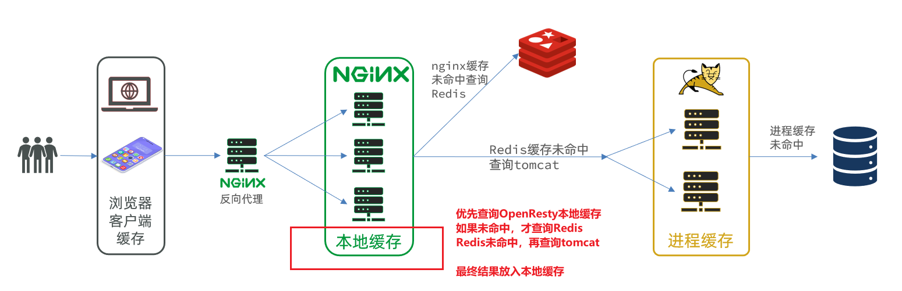
>本地缓存 API

OpenResty为Nginx提供了**shard dict**的功能，可以在nginx的多个worker之间共享数据，实现缓存功能。

1）开启共享字典，在nginx.conf的http下添加配置：
```nginx
 # 共享字典，也就是本地缓存，名称叫做：item_cache，大小150m
 lua_shared_dict item_cache 150m; 
```

2）操作共享字典：
```lua
-- 获取本地缓存对象
local item_cache = ngx.shared.item_cache
-- 存储, 指定key、value、过期时间，单位s，默认为0代表永不过期
item_cache:set('key', 'value', 1000)
-- 读取
local val = item_cache:get('key')
```

>实现本地缓存查询

1）修改`/usr/local/openresty/lua/item.lua`文件，修改read_data查询函数，添加本地缓存逻辑：
```lua
-- 导入共享词典，本地缓存
local item_cache = ngx.shared.item_cache

-- 封装查询函数
function read_data(key, expire, path, params)
    -- 查询本地缓存
    local val = item_cache:get(key)
    if not val then
        ngx.log(ngx.ERR, "本地缓存查询失败，尝试查询Redis， key: ", key)
        -- 查询redis
        val = read_redis("127.0.0.1", 6379, key)
        -- 判断查询结果
        if not val then
            ngx.log(ngx.ERR, "redis查询失败，尝试查询http， key: ", key)
            -- redis查询失败，去查询http
            val = read_http(path, params)
        end
    end
    -- 查询成功，把数据写入本地缓存
    item_cache:set(key, val, expire)
    -- 返回数据
    return val
end
```

2）修改item.lua中查询商品和库存的业务，实现最新的read_data函数：
其实就是多了缓存时间参数，过期后nginx缓存会自动删除，下次访问即可更新缓存。

#### 缓存同步

##### 数据同步策略

缓存数据同步的常见方式有三种：
**设置有效期**：给缓存设置有效期，到期后自动删除。再次查询时更新
- 优势：简单、方便
- 缺点：时效性差，缓存过期之前可能不一致
- 场景：更新频率较低，时效性要求低的业务

**同步双写**：在修改数据库的同时，直接修改缓存
- 优势：时效性强，缓存与数据库强一致
- 缺点：有代码侵入，耦合度高；
- 场景：对一致性、时效性要求较高的缓存数据

**异步通知：修改数据库时发送事件通知，相关服务监听到通知后修改缓存数据**
- 优势：低耦合，可以同时通知多个缓存服务
- 缺点：时效性一般，可能存在中间不一致状态（现在的 RocketMQ等工具 时效性、可靠性都挺强）
- 场景：时效性要求一般，有多个服务需要同步

而异步实现又可以基于MQ或者Canal来实现：

1）基于MQ的异步通知：

解读：
- 商品服务完成对数据的修改后，只需要发送一条消息到MQ中。
- 缓存服务监听MQ消息，然后完成对缓存的更新
依然有少量的代码侵入。

2）基于Canal的通知

解读：
- 商品服务完成商品修改后，业务直接结束，没有任何代码侵入
- Canal监听MySQL变化，当发现变化后，立即通知缓存服务
- 缓存服务接收到canal通知，更新缓存
代码零侵入

##### 认识 Canal

**Canal kə'næl**，译意为水道/管道/沟渠，canal是阿里巴巴旗下的一款开源项目，基于Java开发。基于数据库增量日志解析，提供增量数据订阅&消费。GitHub的地址：[https://github.com/alibaba/canal](https://github.com/alibaba/canal)
Canal是基于mysql的主从同步来实现的，MySQL主从同步的原理如下：
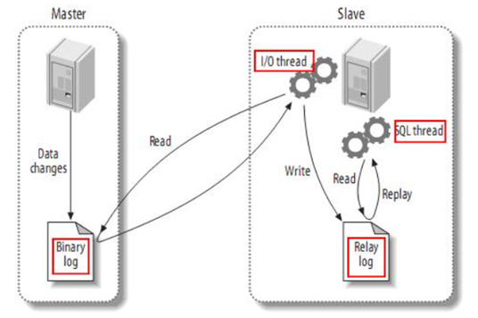
- 1）MySQL master 将数据变更写入二进制日志( binary log），其中记录的数据叫做binary log events
- 2）MySQL slave 将 master 的 binary log events拷贝到它的中继日志(relay log)
- 3）MySQL slave 重放 relay log 中事件，将数据变更反映它自己的数据

而Canal就是把自己伪装成MySQL的一个slave节点，从而监听master的binary log变化。再把得到的变化信息通知给Canal的客户端，进而完成对其它数据库的同步。

##### 安装 Canal

#TODO 见文档

##### 监听 Canal

Canal提供了各种语言的客户端，当Canal监听到binlog变化时，会通知Canal的客户端。

我们可以利用Canal提供的Java客户端，监听Canal通知消息。当收到变化的消息时，完成对缓存的更新。
不过这里我们会使用GitHub上的第三方开源的canal-starter客户端。地址：[https://github.com/NormanGyllenhaal/canal-client](https://github.com/NormanGyllenhaal/canal-client)
**与SpringBoot完美整合，自动装配，比官方客户端要简单好用很多。**

1）引入依赖
2）编写配置
3）修改 Item 实体类
```java
@Data
@TableName("tb_item")
public class Item {
    @TableId(type = IdType.AUTO)
    @Id
    private Long id;//商品id
    @Column(name = "name")
    private String name;//商品名称
    private String title;//商品标题
    private Long price;//价格（分）
    private String image;//商品图片
    private String category;//分类名称
    private String brand;//品牌名称
    private String spec;//规格
    private Integer status;//商品状态 1-正常，2-下架
    private Date createTime;//创建时间
    private Date updateTime;//更新时间
    @TableField(exist = false)
    @Transient
    private Integer stock;
    @TableField(exist = false)
    @Transient
    private Integer sold;
}
```
4）编写监听器
通过实现`EntryHandler<T>`接口编写监听器，监听Canal消息。注意两点：
- 实现类通过`@CanalTable("tb_item")`指定监听的表信息
- EntryHandler的泛型是与表对应的实体类
```java
@CanalTable("tb_item")
@Component
public class ItemHandler implements EntryHandler<Item> {

    @Autowired
    private RedisHandler redisHandler;
    @Autowired
    private Cache<Long, Item> itemCache;

    @Override
    public void insert(Item item) {
        // 写数据到JVM进程缓存
        itemCache.put(item.getId(), item);
        // 写数据到redis
        redisHandler.saveItem(item);
    }

    @Override
    public void update(Item before, Item after) {
        // 写数据到JVM进程缓存
        itemCache.put(after.getId(), after);
        // 写数据到redis
        redisHandler.saveItem(after);
    }

    @Override
    public void delete(Item item) {
        // 删除数据到JVM进程缓存
        itemCache.invalidate(item.getId());
        // 删除数据到redis
        redisHandler.deleteItemById(item.getId());
    }
}
```
- RedisHandler 是做**缓存预热**时编写的一个类
- itemCache 是做**进程缓存**时编写的一个类

## Redis 最佳实践

### Redis 键值设计

#### 优雅的 Key 结构

Redis的Key虽然可以自定义，但最好遵循下面的几个最佳实践约定：
- 遵循基本格式：业务名称:数据名:id
- 长度不超过44字节（embstr 的上限）
- 不包含特殊字符

这样设计的好处：
- 可读性强
- 避免key冲突
- 方便管理
- 更节省内存： key是string类型，底层编码包含int、embstr和raw三种。embstr在小于44字节使用，采用连续内存空间，内存占用更小。当字节数大于44字节时，会转为raw模式存储，在raw模式下，内存空间不是连续的，而是采用一个指针指向了另外一段内存空间，在这段空间里存储SDS内容，这样空间不连续，访问的时候性能也就会收到影响，还有可能产生内存碎片
#### 拒绝 BigKey

BigKey通常以Key的大小和Key中成员的数量来综合判定，例如：
- Key本身的数据量过大：一个String类型的Key，它的值为5 MB
- Key中的成员数过多：一个ZSET类型的Key，它的成员数量为10,000个
- Key中成员的数据量过大：一个Hash类型的Key，它的成员数量虽然只有1,000个但这些成员的Value（值）总大小为100 MB

如何判断元素的大小呢？redis也给我们提供了命令


推荐值：
- 单个key的value小于10KB
- 对于集合类型的key，建议元素数量小于1000

>BigKey 的危害

- 网络阻塞
    - 对BigKey执行读请求时，少量的QPS就可能导致带宽使用率被占满，导致Redis实例，乃至所在物理机变慢
- 数据倾斜
    - BigKey所在的Redis实例内存使用率远超其他实例，无法使数据分片的内存资源达到均衡
- Redis阻塞
    - 对元素较多的hash、list、zset等做运算会耗时较旧，使主线程被阻塞
- CPU压力
    - 对BigKey的数据序列化和反序列化会导致CPU的使用率飙升，影响Redis实例和本机其它应用

>如何发现 BigKey

1）redis-cli --bigkeys
利用redis-cli提供的--bigkeys参数，可以遍历分析所有key，并返回Key的整体统计信息与每个数据的Top1的big key

命令：`redis-cli -a 密码 --bigkeys`


2）scan 扫描
自己编程，利用scan扫描Redis中的所有key，利用strlen、hlen等命令判断key的长度（此处不建议使用MEMORY USAGE）

scan 命令调用完后每次会返回2个元素，第一个是下一次迭代的光标，第一次光标会设置为0，当最后一次scan 返回的光标等于0时，表示整个scan遍历结束了，第二个返回的是List，一个匹配的key的数组
```java
public class JedisTest {
    private Jedis jedis;

    @BeforeEach
    void setUp() {
        // 1.建立连接
        // jedis = new Jedis("192.168.150.101", 6379);
        jedis = JedisConnectionFactory.getJedis();
        // 2.设置密码
        jedis.auth("123321");
        // 3.选择库
        jedis.select(0);
    }

    final static int STR_MAX_LEN = 10 * 1024;
    final static int HASH_MAX_LEN = 500;

    @Test
    void testScan() {
        int maxLen = 0;
        long len = 0;

        String cursor = "0";
        do {
            // 扫描并获取一部分key
            ScanResult<String> result = jedis.scan(cursor);
            // 记录cursor
            cursor = result.getCursor();
            List<String> list = result.getResult();
            if (list == null || list.isEmpty()) {
                break;
            }
            // 遍历
            for (String key : list) {
                // 判断key的类型
                String type = jedis.type(key);
                switch (type) {
                    case "string":
                        len = jedis.strlen(key);
                        maxLen = STR_MAX_LEN;
                        break;
                    case "hash":
                        len = jedis.hlen(key);
                        maxLen = HASH_MAX_LEN;
                        break;
                    case "list":
                        len = jedis.llen(key);
                        maxLen = HASH_MAX_LEN;
                        break;
                    case "set":
                        len = jedis.scard(key);
                        maxLen = HASH_MAX_LEN;
                        break;
                    case "zset":
                        len = jedis.zcard(key);
                        maxLen = HASH_MAX_LEN;
                        break;
                    default:
                        break;
                }
                if (len >= maxLen) {
                    System.out.printf("Found big key : %s, type: %s, length or size: %d %n", key, type, len);
                }
            }
        } while (!cursor.equals("0"));
    }
    
    @AfterEach
    void tearDown() {
        if (jedis != null) {
            jedis.close();
        }
    }
}
```

3）第三方工具
- 利用第三方工具，如 Redis-Rdb-Tools 分析RDB快照文件，全面分析内存使用情况
- [https://github.com/sripathikrishnan/redis-rdb-tools](https://github.com/sripathikrishnan/redis-rdb-tools)

4）网络监控
- 自定义工具，监控进出Redis的网络数据，超出预警值时主动告警
- 一般阿里云搭建的云服务器就有相关监控页面

>如何删除 BigKey

BigKey内存占用较多，即便时删除这样的key也需要耗费很长时间，导致Redis主线程阻塞，引发一系列问题。

Redis在4.0后提供了异步删除的命令：unlink

#### 恰当的数据类型

#TODO 待完成

### 批处理优化

#### pipeline

当我们的客户端与 Redis 服务器交互时：redis处理指令很快，主要花费的时候在于网络传输，因此多条指令交给 redis 处理时选择批处理是效率最高的
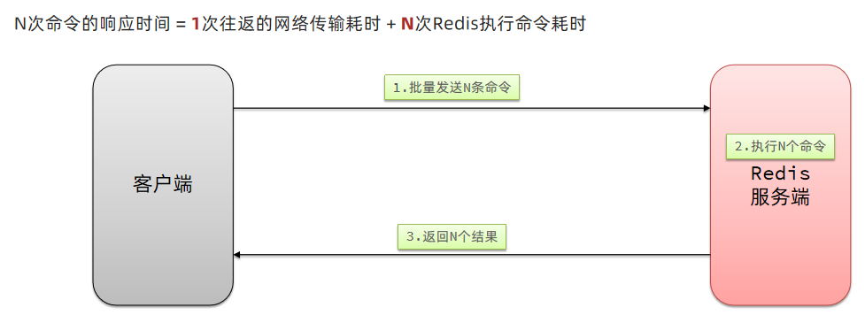
>Mset

Redis提供了很多Mxxx这样的命令，可以实现批量插入数据，例如：
- mset
- hmset
利用mset批量插入10万条数据
```java
@Test
void testMxx() {
    String[] arr = new String[2000];
    int j;
    long b = System.currentTimeMillis();
    for (int i = 1; i <= 100000; i++) {
        j = (i % 1000) << 1;
        arr[j] = "test:key_" + i;
        arr[j + 1] = "value_" + i;
        if (j == 0) {
            jedis.mset(arr);
        }
    }
    long e = System.currentTimeMillis();
    System.out.println("time: " + (e - b));
}
```

>pipline

MSET虽然可以批处理，但是却只能操作部分数据类型，因此如果有对复杂数据类型的批处理需要，建议使用Pipeline
```java
@Test
void testPipeline() {
    // 创建管道
    Pipeline pipeline = jedis.pipelined();
    long b = System.currentTimeMillis();
    for (int i = 1; i <= 100000; i++) {
        // 放入命令到管道
        pipeline.set("test:key_" + i, "value_" + i);
        if (i % 1000 == 0) {
            // 每放入1000条命令，批量执行
            pipeline.sync();
        }
    }
    long e = System.currentTimeMillis();
    System.out.println("time: " + (e - b));
}
```

#### 集群下的批处理

如MSET或Pipeline这样的批处理需要在一次请求中携带多条命令，而此时如果Redis是一个集群，那批处理命令的多个key必须落在一个插槽中，否则就会导致执行失败。

这个时候，我们可以找到4种解决方案


优先使用并行 slot 方法
```java
@Test
void testMSetInCluster() {
	Map<String, String> map = new HashMap<>(3);
	map.put("name", "Rose");
	map.put("age", "21");
	map.put("sex", "Female");
	stringRedisTemplate.opsForValue().multiSet(map);
		
	List<String> strings = stringRedisTemplate.opsForValue().multiGet(Arrays.asList("name", "age", "sex"));
	strings.forEach(System.out::println);
}
```

### 服务器端优化

#### 持久化配置

Redis的持久化虽然可以保证数据安全，但也会带来很多额外的开销，因此持久化请遵循下列建议：
- 用来做缓存的Redis实例尽量不要开启持久化功能
- 建议关闭RDB持久化功能，使用AOF持久化
- 利用脚本定期在slave节点做RDB，实现数据备份
- 设置合理的rewrite阈值，避免频繁的bgrewrite
- 配置no-appendfsync-on-rewrite = yes，禁止在rewrite期间做aof，避免因AOF引起的阻塞
- 部署有关建议：
	- Redis实例的物理机要预留足够内存，应对fork和rewrite
	- 单个Redis实例内存上限不要太大，例如4G或8G。可以加快fork的速度、减少主从同步、数据迁移压力
	- 不要与CPU密集型应用部署在一起、
	- 不要与高硬盘负载应用一起部署。例如：数据库、消息队列

#### 慢查询优化

并不是很慢的查询才是慢查询，而是：在Redis执行时耗时超过某个阈值的命令，称为慢查询。

慢查询的危害：由于Redis是单线程的，所以当客户端发出指令后，他们都会进入到redis底层的queue来执行，如果此时有一些慢查询的数据，就会导致大量请求阻塞，从而引起报错，所以我们需要解决慢查询问题。

>配置

- `slowlog-log-slower-than`：慢查询阈值，单位是微秒。默认是10000，建议1000
- `slowlog-max-len`：慢查询日志（本质是一个队列）的长度。默认是128，建议1000


>查看

- `slowlog len`：查询慢查询日志长度
- `slowlog get [n]`：读取n条慢查询日志
- `slowlog reset`：清空慢查询列表


#### 命令及安全配置

Redis会绑定在0.0.0.0:6379，这样将会将Redis服务暴露到公网上，而Redis如果没有做身份认证，会出现严重的安全漏洞. 漏洞重现方式：[https://cloud.tencent.com/developer/article/1039000](https://cloud.tencent.com/developer/article/1039000)

为什么会出现不需要密码也能够登录呢，主要是Redis考虑到每次登录都比较麻烦，所以Redis就有一种ssh免秘钥登录的方式，生成一对公钥和私钥，私钥放在本地，公钥放在redis端，当我们登录时服务器，再登录时候，他会去解析公钥和私钥，如果没有问题，则不需要利用redis的登录也能访问，这种做法本身也很常见，但是这里有一个前提，前提就是公钥必须保存在服务器上，才行，但是Redis的漏洞在于在不登录的情况下，也能把秘钥送到Linux服务器，从而产生漏洞

漏洞出现的核心的原因有以下几点：
- Redis未设置密码
- 利用了Redis的config set命令动态修改Redis配置
- 使用了Root账号权限启动Redis

为了避免这样的漏洞，这里给出一些建议：
- Redis一定要设置密码
- 禁止线上使用下面命令：keys、flushall、flushdb、config set等命令。可以利用rename-command禁用
- bind：限制网卡，禁止外网网卡访问
- 开启防火墙
- 不要使用Root账户启动Redis
- 尽量不是有默认的端口

#### 内存配置

当Redis内存不足时，可能导致Key频繁被删除、响应时间变长、QPS不稳定等问题。当内存使用率达到90%以上时就需要我们警惕，并快速定位到内存占用的原因。


**有关碎片问题分析：（ Redis 重启即可）**
Redis底层分配并不是这个key有多大，他就会分配多大，而是有他自己的分配策略，比如8,16,20等等，假定当前key只需要10个字节，此时分配8肯定不够，那么他就会分配16个字节，多出来的6个字节就不能被使用，这就是我们常说的 碎片问题

**进程内存问题分析：（忽略）**
这片内存，通常我们都可以忽略不计

**缓冲区内存问题分析：（重点考虑）**
一般包括客户端缓冲区、AOF缓冲区、复制缓冲区等。客户端缓冲区又包括输入缓冲区和输出缓冲区两种。这部分内存占用波动较大，所以这片内存也是我们需要重点分析的内存问题。

>命令

- `info memory`：查看内存分配的情况

- memory xxx：查看key的主要占用情况


>解决缓冲区内存

内存缓冲区常见的有三种：
- **复制缓冲区：**
主从复制的repl_backlog_buf，如果太小可能导致频繁的全量复制，影响性能。通过replbacklog-size来设置，默认1mb
- **AOF缓冲区：**
AOF刷盘之前的缓存区域，AOF执行rewrite的缓冲区。无法设置容量上限
- **客户端缓冲区：（重点考虑）**
分为输入缓冲区和输出缓冲区，输入缓冲区最大1G且不能设置。输出缓冲区可以设置

以上复制缓冲区和AOF缓冲区 不会有问题，最关键就是客户端缓冲区的问题

客户端缓冲区：指的就是我们发送命令时，客户端用来缓存命令的一个缓冲区，也就是我们向redis输入数据的输入端缓冲区和redis向客户端返回数据的响应缓存区，输入缓冲区最大1G且不能设置，所以这一块我们根本不用担心，如果超过了这个空间，redis会直接断开，因为本来此时此刻就代表着redis处理不过来了，我们需要担心的就是输出端缓冲区

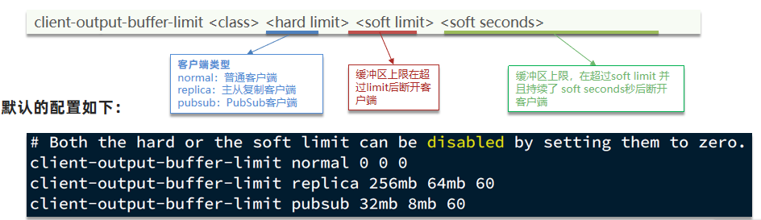

我们在使用redis过程中，处理大量的big value，那么会导致我们的输出结果过多，如果输出缓存区过大，会导致redis直接断开，而默认配置的情况下， 其实他是没有大小的，这就比较坑了，内存可能一下子被占满，会直接导致咱们的redis断开，所以解决方案有两个：
1. 设置一个大小
2. 增加我们带宽的大小，避免我们出现大量数据从而直接超过了redis的承受能力

#### 集群还是主从

集群虽然具备高可用特性，能实现自动故障恢复，但是如果使用不当，也会存在一些问题：
- 集群完整性问题
- 集群带宽问题
- 数据倾斜问题
- 客户端性能问题
- 命令的集群兼容性问题
- lua和事务问题

>在Redis的默认配置中，如果发现任意一个插槽不可用，则整个集群都会停止对外服务

大家可以设想一下，如果有几个slot不能使用，那么此时整个集群都不能用了，我们在开发中，其实最重要的是可用性，所以需要把如下配置修改成no，即有slot不能使用时，我们的redis集群还是可以对外提供服务


>集群带宽问题

集群节点之间会不断的互相Ping来确定集群中其它节点的状态。每次Ping携带的信息至少包括：
- 插槽信息
- 集群状态信息
集群中节点越多，集群状态信息数据量也越大，10个节点的相关信息可能达到1kb，此时每次集群互通需要的带宽会非常高，这样会导致集群中大量的带宽都会被ping信息所占用，这是一个非常可怕的问题，所以我们需要去解决这样的问题

**解决途径：**
- 避免大集群，集群节点数不要太多，最好少于1000，如果业务庞大，则建立多个集群。
- 避免在单个物理机中运行太多Redis实例
- 配置合适的cluster-node-timeout值

>命令的集群兼容性问题

有关这个问题咱们已经探讨过了，当我们使用批处理的命令时，redis要求我们的key必须落在相同的slot上，然后大量的key同时操作时，是无法完成的，所以客户端必须要对这样的数据进行处理，这些方案我们之前已经探讨过了，所以不再这个地方赘述了。

>lua 和事务的问题

lua和事务都是要保证原子性问题，如果你的key不在一个节点，那么是无法保证lua的执行和事务的特性的，所以在集群模式是没有办法执行lua和事务的

>那到底选择集群还是主从？

单体Redis（主从Redis）已经能达到万级别的QPS，并且也具备很强的高可用特性。如果主从能满足业务需求的情况下，所以如果不是在万不得已的情况下，尽量不搭建Redis集群

---
>[!tip] 接下来是 Redis 原理篇

## Redis 数据结构

### 底层数据结构

#### SDS 动态字符串

我们都知道Redis中保存的Key是字符串，value往往是字符串或者字符串的集合。可见字符串是Redis中最常用的一种数据结构。
不过Redis没有直接使用C语言中的字符串，因为C语言字符串存在很多问题：
- 获取字符串长度的需要通过运算
- 非二进制安全
- 不可修改
Redis构建了一种新的字符串结构，称为**简单动态字符串（Simple Dynamic String），简称SDS。**

>源码案例

例如，我们执行命令：


那么Redis将在底层创建两个SDS，其中一个是包含“name”的SDS，另一个是包含“虎哥”的SDS。
Redis是C语言实现的，其中SDS是一个结构体，源码如下：


例如，一个包含字符串“name”的sds结构如下：
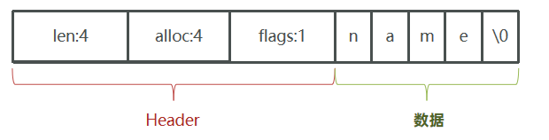
>动态扩容

SDS之所以叫做动态字符串，是因为它具备动态扩容的能力，例如一个内容为“hi”的SDS：

假如我们要给SDS追加一段字符串“,Amy”，这里首先会申请新内存空间：
- 如果新字符串小于1M，则新空间为扩展后字符串长度的两倍+1；
- 如果新字符串大于1M，则新空间为扩展后字符串长度+1M+1。称为内存预分配。

注意：alloc 不包含最后一个 `\0` ，所以是 12。实际上申请的总内存是 13

>优点总结

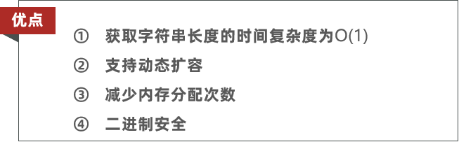

#### IntSet

IntSet是Redis中set集合的一种实现方式，基于整数数组来实现，并且具备长度可变、有序等特征。

>结构

结构如下：


其中的encoding包含三种模式，表示存储的整数大小不同：


为了方便查找，Redis会将intset中所有的整数按照升序依次保存在contents数组中，结构如图：
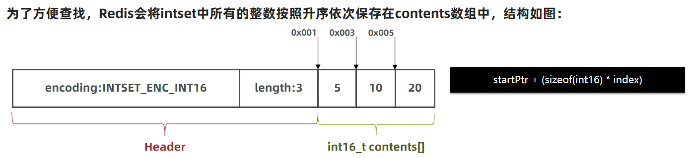

现在，数组中每个数字都在int16_t的范围内，因此采用的编码方式是INTSET_ENC_INT16，每部分占用的字节大小为：
- encoding：4字节 
- length：4字节 
- contents：2字节 * 3 = 6字节
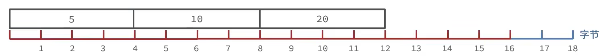

>添加数字

我们向该其中添加一个数字：50000，这个数字超出了int16_t的范围，intset会自动升级编码方式到合适的大小。
以当前案例来说流程如下：
- 升级编码为INTSET_ENC_INT32, 每个整数占4字节，并按照新的编码方式及元素个数扩容数组
- 倒序依次将数组中的元素拷贝到扩容后的正确位置
- 将待添加的元素放入数组末尾
- 最后，将inset的encoding属性改为INTSET_ENC_INT32，将length属性改为4

>源码


>总结

Intset可以看做是特殊的整数数组，具备一些特点：
- Redis会确保Intset中的元素唯一、有序
- 具备类型升级机制，可以节省内存空间
- 底层采用二分查找方式来查询

#### Dict

我们知道Redis是一个键值型（Key-Value Pair）的数据库，我们可以根据键实现快速的增删改查。而键与值的映射关系正是通过Dict来实现的。

>结构

Dict由三部分组成，分别是：哈希表（DictHashTable）、哈希节点（DictEntry）、字典（Dict）


当我们向Dict添加键值对时，Redis首先根据key计算出hash值（h），然后利用 h & sizemask来计算元素应该存储到数组中的哪个索引位置。我们存储k1=v1，假设k1的哈希值h =1，则1&3 =1，因此k1=v1要存储到数组角标1位置。


>Dict 的 rehash


1）

2）

3）

>总结

Dict的结构：
- 类似java的HashTable，底层是数组加链表来解决哈希冲突
- Dict包含两个哈希表，ht[0]平常用，ht[1]用来rehash

Dict的伸缩：
- 当LoadFactor大于5或者LoadFactor大于1并且没有子进程任务时，Dict扩容
- 当LoadFactor小于0.1时，Dict收缩
- 扩容大小为第一个大于等于used + 1的2^n
- 收缩大小为第一个大于等于used 的2^n
- Dict采用渐进式rehash，每次访问Dict时执行一次rehash
- rehash时ht[0]只减不增，新增操作只在ht[1]执行，其它操作在两个哈希表

#### ZipList

ZipList 是一种特殊的“双端链表” （**但不是由指针指向前后节点**），由一系列特殊编码的连续内存块组成。可以在任意一端进行压入/弹出操作, 并且该操作的时间复杂度为 O(1)
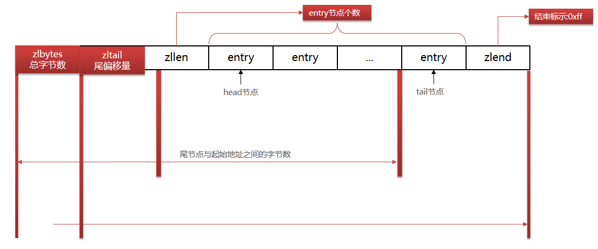


>ZipListEntry


>Encoding 编码

- 字符串：


- 整数：


>连锁更新问题

ZipList的每个Entry都包含previous_entry_length来记录上一个节点的大小，长度是1个或5个字节：
- 如果前一节点的长度小于254字节，则采用1个字节来保存这个长度值
- 如果前一节点的长度大于等于254字节，则采用5个字节来保存这个长度值，第一个字节为0xfe，后四个字节才是真实长度数据
现在，假设我们有N个连续的、长度为250~253字节之间的entry，因此entry的previous_entry_length属性用1个字节即可表示，如图所示：


ZipList这种特殊情况下产生的连续多次空间扩展操作称之为**连锁更新（Cascade Update）**。新增、删除都可能导致连锁更新的发生。

>总结

**ZipList特性：**
- 压缩列表的可以看做一种连续内存空间的"双向链表"
- 列表的节点之间不是通过指针连接，而是记录上一节点和本节点长度来寻址，内存占用较低
- 如果列表数据过多，导致链表过长，可能影响查询性能
- 增或删较大数据时有可能发生连续更新问题

#### QuickList


>控制 ZipList entry 数量


>ZipList 压缩


>源码

以下是QuickList的和QuickListNode的结构源码：


我们接下来用一段流程图来描述当前的这个结构：


>总结

QuickList的特点：
- 是一个节点为ZipList的双端链表
- 节点采用ZipList，解决了传统链表的内存占用问题
- 控制了ZipList大小，解决连续内存空间申请效率问题
- 中间节点可以压缩，进一步节省了内存

#### SkipList


>源码


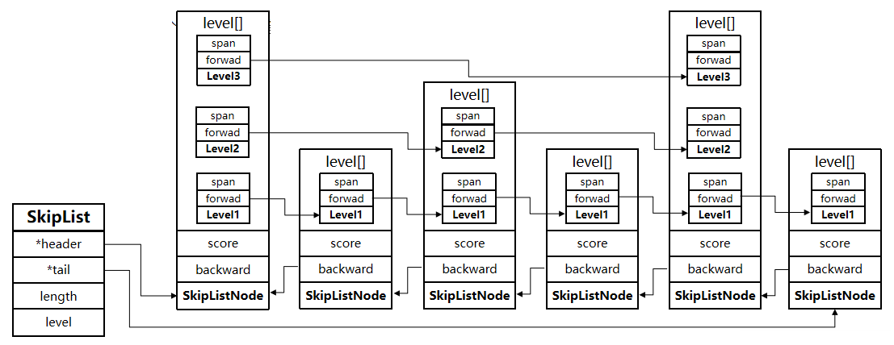

>总结

SkipList的特点：
- 跳跃表是一个双向链表，每个节点都包含score和ele值
- 节点按照score值排序，score值一样则按照ele字典排序
- 每个节点都可以包含多层指针，层数是1到32之间的随机数
- 不同层指针到下一个节点的跨度不同，层级越高，跨度越大
- 增删改查效率与红黑树基本一致，实现却更简单

### RedisObject

在 Redis 中，每个键值对的键都是一个由 SDS 存储的字符串，而它的值则会被封装成一个 `RedisObject`，也叫做Redis对象，源码如下：


>什么是 RedisObject ？

- 从Redis的使用者的角度来看：
⼀个Redis节点包含多个database（非cluster模式下默认是16个，cluster模式下只能是1个），而一个database维护了从key space到object space的映射关系。这个映射关系的key是string类型，⽽value可以是多种数据类型，比如： string, list, hash、set、sorted set等。我们可以看到，key的类型固定是string，而value可能的类型是多个。 
- ⽽从Redis内部实现的⾓度来看：
database内的这个映射关系是用⼀个dict来维护的。dict的key固定用⼀种数据结构来表达就够了，这就是动态字符串sds。而value则比较复杂，为了在同⼀个dict内能够存储不同类型的value，这就需要⼀个通⽤的数据结构，这个通用的数据结构就是robj，全名是redisObject。

>编码方式


>五种数据结构


### 数据类型

#### String


>[!tip] 使用建议
>使用 String 数据类型时，尽量存储数字或者是长度小于44的字符串，避免使用 RAW 编码

#### List

Redis的List类型可以从首、尾操作列表中的元素：

哪一个数据结构能满足上述特征？
- LinkedList ：普通链表，可以从双端访问，内存占用较高，内存碎片较多
- ZipList ：压缩列表，可以从双端访问，内存占用低，存储上限低
- QuickList：LinkedList + ZipList，可以从双端访问，内存占用较低，包含多个ZipList，存储上限高

>源码


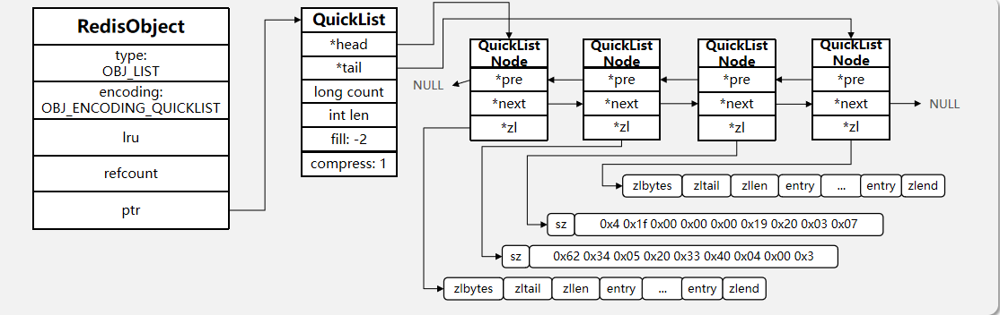

#### Set

Set是Redis中的单列集合，满足下列特点：
- 不保证有序性
- 保证元素唯一
- 求交集、并集、差集
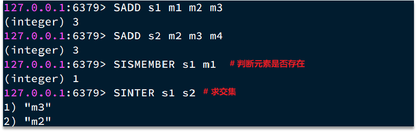
可以看出，Set对查询元素的效率要求非常高，思考一下，什么样的数据结构可以满足？ 
- HashTable，也就是Redis中的Dict，不过Dict是双列集合（可以存键、值对）

>源码


>结构图

encoding有两种编码方式：
- intset：ptr 指向上面那张表格
- HT：（dict）如下面的表格所示


ps：表格有误，dictht 的 used 应该为4

#### ZSet

>编码


>结构图


>编码转换


zsetAdd函数：（考虑两种编码）


>ZipList 本身不支持 ZSet 要求的功能，怎么实现？


#### Hash

>编码


>编码转换


## Redis 网络模型

### 用户空间和内核空间


### Linux 五种不同的 IO 模型


#### 阻塞 IO


- 性能不怎么好
#### 非阻塞 IO


- 性能和阻塞 IO 一样差，CPU 使用率还会暴增
- 特定场合使用时反而会是个好选择

#### IO 多路复用

>解决方案


>FD


- 类比餐厅：一次性监听多个顾客，而不是排队点餐

>三种实现方式


##### IO多路复用-select


select模式存在的问题：
1. 需要将整个fd_set从用户空间拷贝到内核空间，select结束还要再次拷贝回用户空间
2. select无法得知具体是哪个fd就绪，需要遍历整个fd_set
3. fd_set监听的fd数量不能超过1024

##### IO多路复用-poll


- 除了改进 select 模式的问题3，其他没改进，性能也没什么提升。
- 链表随着数量的增加，因为链表遍历，性能会变差
- Linux 基本没怎么使用

##### IO多路复用-epoll


优势（相比较select解决的问题）：
1. fd只需要拷贝一次（执行一次ctl），就会一直添加到红黑树上，以后的循环过程中不需要再拷贝
2. 每次只拷贝就绪的fd，减少拷贝的次数（每个fd只拷贝一次），减少拷贝数量（只拷贝就绪的fd）
3. 红黑树理论上讲支持的数量无限，红黑树增删改查的性能基本不会因为数量改变而改变，性能好而且稳定

>总结

select模式存在的三个问题：
* 能监听的FD最大不超过1024
* 每次select都需要把所有要监听的FD都拷贝到内核空间
* 每次都要遍历所有FD来判断就绪状态
poll模式的问题：
* poll利用链表解决了select中监听FD上限的问题，但依然要遍历所有FD，如果监听较多，性能会下降
epoll模式中如何解决这些问题的？
* 基于epoll实例中的红黑树保存要监听的FD，理论上无上限，而且增删改查效率都非常高
* 每个FD只需要执行一次epoll_ctl添加到红黑树，以后每次epol_wait无需传递任何参数，无需重复拷贝FD到内核空间
* 利用ep_poll_callback机制来监听FD状态，无需遍历所有FD，因此性能不会随监听的FD数量增多而下降

##### 事件通知机制


LT 模式缺点：
1. 重复通知影响性能
2. 惊群问题

##### web服务流程

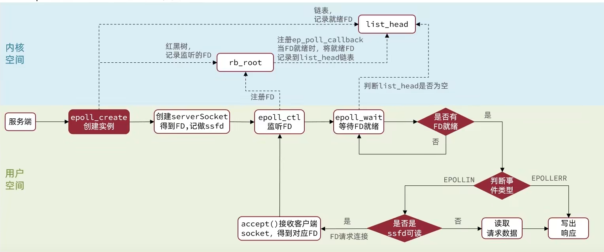

#### 信号驱动 IO


#### 异步 IO


>同步还是异步


### Redis 网络模型

>Redis到底是单线程还是多线程？

- 如果仅仅聊Redis的核心业务部分（命令处理），答案是单线程
- 如果是聊整个Redis，那么答案就是多线程

在Redis版本迭代过程中，在两个重要的时间节点上引入了多线程的支持：

- Redis v4.0：引入多线程异步处理一些耗时较旧的任务，例如异步删除命令unlink
- Redis v6.0：在核心网络模型中引入 多线程，进一步提高对于多核CPU的利用率

因此，对于Redis的核心网络模型，在Redis 6.0之前确实都是单线程。是利用epoll（Linux系统）这样的IO多路复用技术在事件循环中不断处理客户端情况。

>为什么Redis要选择单线程？

* 抛开持久化不谈，Redis是纯  内存操作，执行速度非常快，它的性能瓶颈是网络延迟而不是执行速度，因此多线程并不会带来巨大的性能提升。
* 多线程会导致过多的上下文切换，带来不必要的开销（单核情况下）
* 引入多线程会面临线程安全问题，必然要引入线程锁这样的安全手段，实现复杂度增高，而且性能也会大打折扣

>为什么单线程速度快？

- Redis是纯 内存操作，执行速度非常快（最主要）
- 其他：IO多路复用

>不同的多路复用（用哪个取决于你的操作系统）


>Redis 单线程网络模型的流程

>[!tip] Tips
>源码解析见黑马视频＆PPT
>实在太干货了🤣
>牢记第二幅图！！！可对面试官装逼


传统单线程模型下，真正影响性能的不是命令处理，也不是IO多路复用，而是IO：与数据库连接，与MySQL连接……

## Redis 通信协议

### RESP 协议


- RESP2和RESP3兼容性问题比较大

>数据类型


## Redis 内存策略


### 过期策略

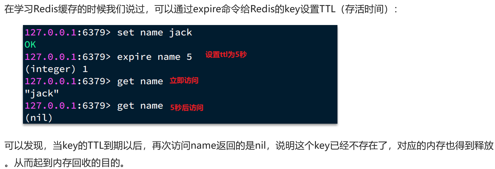

#### DB 结构

>[!tip] Redis 是如何知道一个key是否过期呢？
>利用两个Dict分别记录key-value对及key-ttl对


>[!tip] 是不是TTL到期就立即删除了呢？
>- 惰性删除
>- 周期删除

#### 惰性删除


#### 周期删除


### 淘汰策略

>内存淘汰


>淘汰策略


- LRU：最近没用（用的时间远）
- LFU：用的频率低

>结构


>流程


