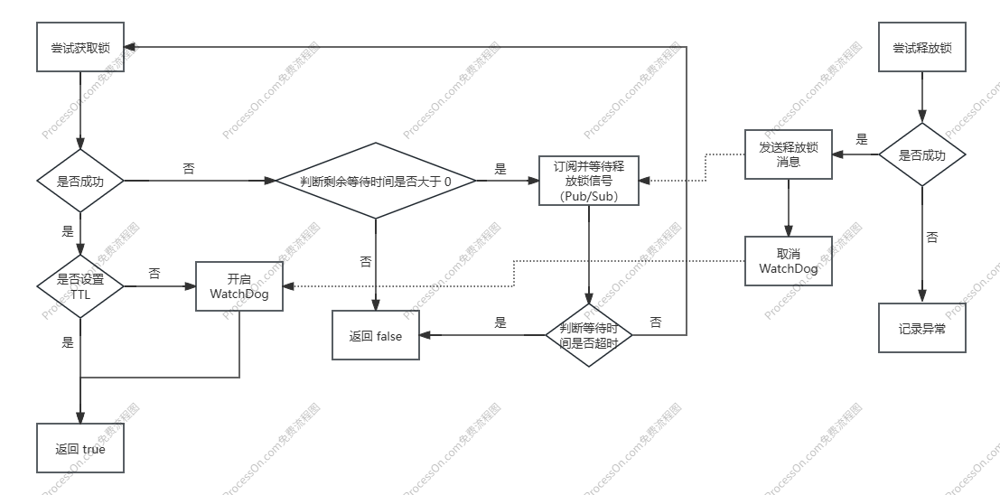
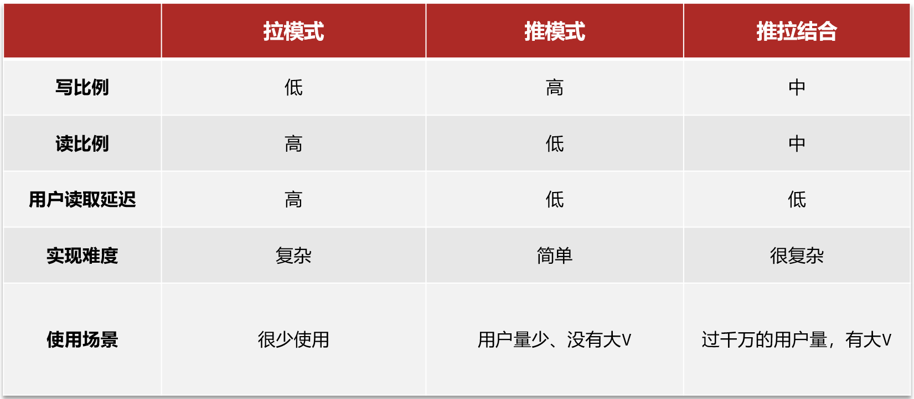

# 黑马点评

>[!tip] 模块介绍
>主要功能模块：
>1. 用户登录（验证码登录、短信登录）
>2. 商户查询（地理位置、推荐）
>3. 点评功能（点赞、分页）
>4. 店铺签到、用户签到记录
>5. 商户缓存（ [[Redis]] 解决缓存击穿、雪崩、穿透）
>6. 热点评价、排行榜（基于点赞数）
>7. 缓存预热、逻辑过期、互斥锁等优化方案
>8. 后台管理（数据统计、用户管理）

| 技术                    | 说明                                  |
| --------------------- | ----------------------------------- |
| **Spring Boot**       | 核心框架，构建 REST API                    |
| **Spring MVC**        | 控制层实现                               |
| **Spring Data Redis** | 缓存、分布式锁、签到功能等                       |
| **MyBatis-Plus**      | 持久层 ORM 框架，简化 MyBatis               |
| **MySQL**             | 主数据库（业务数据）                          |
| **[[Redis]]**         | 缓存（商户缓存、验证码、签到等）、分布式计数、HyperLogLog等 |

## 技术指南

### Session 和 Cookie 的区别？

| 特性       | Cookie                                         | Session                                        |
| -------- | ---------------------------------------------- | ---------------------------------------------- |
| **存储位置** | 客户端（浏览器）                                       | 服务端（内存、文件、数据库或分布式缓存如 Redis）                    |
| **存储内容** | 通常只存储少量信息，最常见的是 **Session ID**                 | 存储**用户的大量敏感或非敏感数据**，如用户ID、用户名、登录状态、权限信息等       |
| **安全性**  | 相对较低。数据直接暴露在客户端，易被篡改或窃取                        | 较高。敏感数据存储在服务器端，客户端只持有 Session ID               |
| **容量限制** | 每个 Cookie 大小限制在 4KB 左右，且每个域名下的 Cookie 数量也有限制   | 理论上只受服务器存储能力的限制，容量更大                           |
| **生命周期** | 可以是会话级别 (浏览器关闭即失效)，也可以是持久化 (设置过期时间)            | 依赖于 Session ID 的有效性，通常服务器会设置一个超时时间。长时间不活动会自动失效 |
| **作用**   | 主要用于**客户端的状态维护**，让浏览器记住一些信息，最核心的是传递 Session ID | 主要用于**服务器端的状态维护**，让服务器记住用户是谁以及其相关信息            |
### 登录时：Session 和 Cookie 有什么作用？

- **用户提交登录信息 (如用户名、密码)：**
    
    - 用户在浏览器中输入信息并点击登录。
        
- **浏览器将登录信息发送给服务器：**
    
    - 这是一个普通的 HTTP POST 请求。
        
- **服务器验证身份：**
    
    - 服务器接收到用户名和密码。
        
    - 服务器查询数据库（或其他用户存储），验证用户名和密码是否匹配。
        
- **【Session 的作用】验证成功后，服务器创建 Session：**
    
    - 如果验证通过，服务器知道这是一个合法用户。
        
    - 服务器会为这个已登录的用户在**服务器端**创建一个唯一的“会话”记录。
        
    - 这个记录包含用户的身份信息（例如，`userId=123`，`username=zhangsan`，以及登录时间、权限等）。
        
    - 服务器会给这个 Session 记录分配一个**唯一的 Session ID**（例如 `ABCXYZ123`）。
        
    - 这个 Session ID 和对应的用户数据（Key-Value 对）会被存储在服务器端的某个地方，比如：
        
        - **在您的点评项目中，这个地方就是 Redis。** 服务器会将 `ABCXYZ123` 作为 Key，`{userId: 123, username: "zhangsan", ...}` 作为 Value 存储到 Redis 中，并通常会设置一个过期时间（比如 30 分钟不活动就失效）。
            
    - **作用总结：** Session 确保了服务器能够“记住”这位用户，以及该用户在登录后的各种状态信息。
        
- **【Cookie 的作用】服务器将 Session ID 发送给浏览器：**
    
    - 服务器将刚刚生成的 **Session ID** (`ABCXYZ123`) 放置在一个 HTTP 响应头中的 `Set-Cookie` 字段里。
        
    - 这个 `Set-Cookie` 指令告诉浏览器：“嘿，把这个 `Session ID` (通常命名为 `JSESSIONID` 或 `sid` 等) 存起来！”
        
    - 服务器还会设置 Cookie 的一些属性，比如过期时间、作用域等。
        
    - **作用总结：** Cookie 的主要作用是作为**Session ID 的载体**。它将服务器为用户创建的 Session ID 传递回客户端浏览器，并在用户后续的请求中，由浏览器自动带回给服务器。
        
- **浏览器存储 Cookie：**
    
    - 浏览器接收到服务器的响应后，将这个包含 `Session ID` 的 Cookie (例如 `JSESSIONID=ABCXYZ123`) 存储在本地。
        
- **用户后续访问（保持登录状态）：**
    
    - 当用户点击网站上的其他链接（例如“我的订单”、“发布评论”）时，**浏览器会自动将存储的 `JSESSIONID=ABCXYZ123` 这个 Cookie 附加到每个 HTTP 请求头中**，发送给服务器。
        
    - **作用总结：** Cookie 负责在每次请求时，将服务器之前分发给它的“身份凭证”（Session ID）传回给服务器。
        
- **【Session 的作用】服务器根据 Cookie 中的 Session ID 识别用户：**
    
    - 服务器接收到请求后，会从请求头中解析出 `Session ID` (`ABCXYZ123`)。
        
    - 服务器使用这个 `Session ID` 到其**服务器端存储**（例如 Redis）中去查找对应的 Session 数据。
        
    - 如果找到了，并且 Session 未过期，服务器就知道这个请求是来自 `userId=123` 的 `zhangsan` 用户，从而允许他执行相应的操作。
        
    - **作用总结：** Session 允许服务器根据客户端传来的 Session ID，查找到并恢复用户的身份和状态，从而维持用户的登录状态和个性化体验。

**核心区别和协作方式：**

- **Cookie 就像一张“门票”**，这张门票上写着一个**座位号**（Session ID），它存在你（浏览器）的口袋里。
    
- **Session 就像电影院里的“座位和你的预留信息”**，电影院（服务器）根据你门票上的座位号（Session ID），才能找到你的预留信息，并确认你是谁。
    

没有 Cookie（门票），服务器就无法从你那里获取到 Session ID，也就无法找到你的 Session。 没有 Session（服务器端的记录），即使有了 Cookie 中的 Session ID，服务器也无法知道你是谁。

所以，它们是相互依赖，共同实现 Web 应用中用户状态管理的基石。

### 拦截器和 ThreadLocal

#### 拦截器（服务端）

```java
public class LoginInterceptor implements HandlerInterceptor {  
    @Override  
    public boolean preHandle(HttpServletRequest request, HttpServletResponse response, Object handler) throws Exception {  
        HttpSession session = request.getSession();  
        Object user = session.getAttribute("user");  
        if (user == null) {  
            response.setStatus(401);  
            return false;  
        }  
        UserHolder.saveUser( (UserDTO) user);  
        return true;  
    }  
  
    @Override  
    public void afterCompletion(HttpServletRequest request, HttpServletResponse response, Object handler, Exception ex) throws Exception {  
        UserHolder.removeUser();  
    }  
}
```

#### HttpServletRequest 工作原理

调用 `HttpServeletRequest.getSession()` 时，SpringMVC（底层是 Servlet 容器，如 Tomcat）会做：
1. **检查请求中是否包含 Session ID：**
	- 它会检查当前 HTTP 请求的 `Cookie` 头中是否存在一个名为 `JSESSIONID`（或你配置的其他 Session Cookie 名称）的 Cookie
	- 如果存在，它会获取这个 `Session ID`
2. **根据 Session ID 查找 Session 对象：**
	- **关键!** Servlet 容器会使用这个 `Session ID` 到**服务器端**的 Session 存储中去查找对应的 `HttpSession` 对象
	- 在你的 Redis 点评项目中，这个 Session 存储就是 **Redis**。这意味着，当用户登录成功时，你的代码（或者 Spring Session 等框架）已经将 `UserDTO` 对象（或其序列化后的数据）以 `user` 为键，存储到了与该 `Session ID` 关联的 Redis 记录中
3. **返回 `HttpSession` 对象：**
	- 如果找到了对应的 `HttpSession` 对象，容器就将它返回给你
	- 如果没有找到 `Session ID`（比如首次访问），或者找到的 `Session ID` 无效/过期，那么 `request.getSession()` 会**创建一个新的 `HttpSession` 对象**，并生成一个新的 `Session ID`，然后将这个新的 `Session ID` 通过 `Set-Cookie` 头发送回浏览器

#### ThreadLocal

`ThreadLocal` 是 Java 提供的一种机制，它允许你创建一个**线程局部变量**

>核心思想

`ThreadLocal` 为每个使用它的线程都创建了一个变量副本。每个线程都操作自己的副本，互不干扰。

>登录认证中的作用

在 Web 应用中，特别是使用 Spring MVC 这样的框架时，每个 HTTP 请求通常会由服务器（如 Tomcat）分配给一个**独立的线程**来处理。从请求进入拦截器、到达 Controller、再到 Service 层，直到响应返回，整个流程都在这个同一个线程中执行。

当用户登录成功后，我们获取到了用户的 `UserDTO` 信息。在不使用 `ThreadLocal` 的情况下，你可能需要一层一层地将 `UserDTO` 作为参数传递给你的 Controller、Service、甚至 Dao 层方法

这样会导致代码冗余，并且很多业务方法本身并不需要直接操作 `UserDTO`，只是为了传递给下层方法

>`ThreadLocal` 的优点

- **简化代码：** 避免了在方法间层层传递用户信息的参数，使代码更简洁、可读性更好。
- **线程隔离：** 确保每个线程的数据独立，不会出现线程安全问题。

>`ThreadLocal` 的缺点

- 内存泄漏
- 滥用问题
- 调试难度
### Session 共享问题

解决方案：用 Redis 替代 Session


### 拦截器优化

>[!tip] 拦截器的作用
>1. **登录认证（核心作用）**
>	- 拦截器会检查每个进入系统的请求是否携带了有效的**登录凭证（Token）**
>	- 它会从请求头（`Authorization`）中获取 Token，然后拿着这个 Token 去 **Redis** 中查询对应的用户登录信息
>	- 如果 Redis 中没有找到或 Token 无效（例如过期、被篡改），拦截器会立即**拒绝**该请求（返回 401 Unauthorized 状态码），阻止未经认证的用户访问受保护的资源
>	- 如果 Token 有效，拦截器会将用户的信息（例如 `UserDTO`）存储到**线程局部变量（ThreadLocal，例如 `UserHolder`）** 中，以便后续的业务逻辑可以直接获取当前登录用户的信息，而无需再次查询
>2. 统一放行/拦截控制
>	- 拦截器提供了一个集中的控制点，可以根据业务需求决定哪些请求可以继续执行，哪些应该被拦截。例如，对于一些公共资源（如登录页面、注册接口），拦截器可能会选择放行
>3. 提升代码复用性、可维护性
>	- 将登录认证等通用逻辑从具体的业务控制器中抽离出来，避免了大量重复代码
>	- 当认证逻辑需要修改时，只需修改拦截器中的一处代码即可，大大提高了系统的可维护性

此处拦截器优化是针对第二点：
采用了 **“两级拦截器”** 的模式，使用 `RefreshTokenInterceptor` 拦截所有资源并刷新 Token，而 `LoginInterceptor` 只负责校验 `ThreadLocal` 中的用户

原来的设计：
- **特点：** 只有需要登录的接口才会被拦截器处理。公共资源直接放行，不经过任何拦截器
- 潜在问题：
	- **Token 有效期短的问题：** 假设你的 Token 有效期是 30 分钟。用户登录后，30 分钟不操作需要登录的页面，但在操作公共页面，那么 30 分钟后一旦他想进行需要登录的操作，Token 就过期了，需要重新登录。这会影响用户体验。
	- **Redis 中的用户数据有效期问题：** 即使 Token 不过期，但如果 Redis 中保存的用户信息有生命周期，也可能导致数据失效。

优化后的设计：

>`RefreshTokenInterceptor` (拦截所有资源，但放行，只负责刷新 Token)
- **作用：** 无论请求什么资源（包括公共资源），都先经过这个拦截器。
- **逻辑：** 检查请求头是否有 Token。如果有，就去 Redis 查用户数据，并**刷新这个 Token 的有效期**（延长 Redis 中用户数据的生命周期）。最后，将用户信息存入 `ThreadLocal`，然后**放行**请求。
- 好处：
	-  **延长用户在线时间（续期）：** 这是最大的好处。只要用户在活跃地访问任何页面（即使是公共页面），他们的登录状态就会被持续地刷新。这样，用户就不太可能因为 Token 过期而频繁登录，大大提升了用户体验。
	- **公共资源也能利用用户信息：** 虽然最终会放行，但在公共资源页面也可以通过 `ThreadLocal` 获取到当前登录用户信息（如果存在）。这为一些个性化展示提供了可能性，比如“你好，[用户名]”这样的欢迎语。

>`LoginInterceptor` (只拦截需要登录的资源，并校验 `ThreadLocal` 中的用户)
- **作用：** 只拦截那些**需要登录后才能访问的**资源（例如订单创建、个人信息查看等）。
- **逻辑：** 在这个拦截器中，它不再去 Redis 查询，而是直接从 **`ThreadLocal` 中尝试获取用户数据**。如果获取不到，说明用户未登录或 Token 无效（因为 `RefreshTokenInterceptor` 没有成功将用户放入 `ThreadLocal`），则直接拒绝请求（返回 401）。
- 好处：
	- **职责分离更清晰：** `RefreshTokenInterceptor` 专注于 Token 的生命周期管理，`LoginInterceptor` 专注于权限校验。
	- **性能优化：** `LoginInterceptor` 不需要每次都查询 Redis，直接从内存中的 `ThreadLocal` 获取，性能更高。只有在 `RefreshTokenInterceptor` 刷新失败时（例如 Token 第一次过期）才会导致这里获取不到

>好处总结

1. **极大地提升用户体验**：用户登录一次后，只要不长时间不操作，几乎不需要再次登录。这被称为“**无感刷新**”，是现代 Web 应用的标配。
2. **更强的健壮性**：即使 Redis 中的 Token 有效期到了，只要用户在活跃使用，Token 就会被自动续期，避免了因过期而频繁重新登录的问题。
3. **职责更明确，代码更整洁**：两个拦截器各司其职，`RefreshTokenInterceptor` 负责“续命”，`LoginInterceptor` 负责“验明正身”，降低了单个拦截器的复杂性。
4. **更灵活的扩展性**：未来如果需要加入更复杂的权限管理（例如基于角色的权限），可以在 `LoginInterceptor` 中扩展，而刷新逻辑则保持不变。

### 全局 ID


- 符号位：1bit，永远为0
- 时间戳：31bit，以秒为单位，可以使用69年
- 序列号：32bit，秒内的计数器，支持每秒产生2^32个不同ID

### 超卖问题

超卖问题是典型的多线程安全问题，针对这一问题的常见解决方案就是加锁：


>[!tip] CAS 法
>把 `version` 替换为 `stock` 即可
>失败率过高：修改成 stock > 0

### 一人一单（并发安全问题）

>业务逻辑

>并发安全问题

#### 分布式锁


分布式锁：满足分布式系统或集群模式下多进程可见并且互斥的锁。


#### 误删问题

#### 原子性问题

使用 Lua 脚本把释放锁的过程原子化


```lua
if (redis.call('get', KEYS[1]) == ARGV[1]) then  
    return redis.call('del', KEYS[1])  
end  
return 0
```

```java
private static final DefaultRedisScript<Long> UNLOCK_SCRIPT;  
static {  
    UNLOCK_SCRIPT = new DefaultRedisScript<>();  
    UNLOCK_SCRIPT.setLocation(new ClassPathResource("unlock.lua"));  
    UNLOCK_SCRIPT.setResultType(Long.class);  
}

@Override  
public void unlock() {  
    stringRedisTemplate.execute(UNLOCK_SCRIPT,  
            Collections.singletonList(KEY_PREFIX + name),  
            ID_PREFIX + Thread.currentThread().getId());  
}
```

### 分布式锁-Redisson

- [官网地址](https://redisson.pro/)
- [GitHub地址](https://github.com/redisson/redisson)

>优化

>可重入锁原理（解决“不可重入”）


>分布式锁的锁重试和 WatchDog 机制（解决“不可重试”、“超时释放”）


>[!tip]
>第一次尝试获取锁成功：左边一条线
>第一次尝试获取锁失败：往右边分支走

>multiLock 原理（解决“主从一致性”）


### 秒杀优化

>异步秒杀思路


```java
@Slf4j  
@Service  
public class VoucherOrderServiceImpl extends ServiceImpl<VoucherOrderMapper, VoucherOrder> implements IVoucherOrderService {  
  
    @Resource  
    private ISeckillVoucherService seckillVoucherService;  
  
    @Resource  
    private RedisIdWorker redisIdWorker;  
  
    @Resource  
    private StringRedisTemplate stringRedisTemplate;  
  
    @Resource  
    private RedissonClient redissonClient;  
  
    private static final DefaultRedisScript<Long> SECKILL_SCRIPT;  
    static {  
        SECKILL_SCRIPT = new DefaultRedisScript<>();  
        SECKILL_SCRIPT.setLocation(new ClassPathResource("seckill.lua"));  
        SECKILL_SCRIPT.setResultType(Long.class);  
    }  
  
    private BlockingQueue<VoucherOrder> orderTasks = new ArrayBlockingQueue<>(1024 * 1024);  
    private static final ExecutorService SECKILL_ORDER_EXECUTOR = Executors.newSingleThreadExecutor();  
  
    private IVoucherOrderService proxy;  
  
    @PostConstruct  
    private void init() {  
        proxy = (IVoucherOrderService) AopContext.currentProxy();  
        SECKILL_ORDER_EXECUTOR.submit(new VoucherOrderHandler());  
    }  
  
    private class VoucherOrderHandler implements Runnable {  
        @Override  
        public void run() {  
            while (true) {  
                try {  
                    VoucherOrder voucherOrder = orderTasks.take();  
                    handleVoucherOrder(voucherOrder);  
                } catch (Exception e) {  
                    log.error("处理订单异常", e);  
                }  
            }  
        }  
    }  
  
    private void handleVoucherOrder(VoucherOrder voucherOrder) {  
        Long userId = voucherOrder.getUserId();  
        RLock lock = redissonClient.getLock("lock:order:" + userId);  
        boolean isLock = lock.tryLock();  
        if (!isLock) {  
            log.error("不允许重复下单");  
            return;  
        }  
        try {  
            proxy.createVoucherOrder(voucherOrder);  
        } finally {  
            lock.unlock();  
        }  
    }  
  
    @Override  
    public Result seckillVoucher(Long voucherId) {  
        Long userId = UserHolder.getUser().getId();  
        Long result = stringRedisTemplate.execute(  
                SECKILL_SCRIPT,  
                Collections.emptyList(),  
                voucherId.toString(), userId.toString()  
        );  
        int r = result.intValue();  
        if (r != 0) {  
            return Result.fail(r == 1 ? "库存不足" : "不能重复下单");  
        }  
  
        VoucherOrder voucherOrder = new VoucherOrder();  
        long orderId = redisIdWorker.nextId("order");  
        voucherOrder.setId(orderId);  
        voucherOrder.setUserId(userId);  
        voucherOrder.setVoucherId(voucherId);  
  
        orderTasks.add(voucherOrder);  
  
        return Result.ok(0);  
    }  
  
    @Transactional  
    public void createVoucherOrder(VoucherOrder voucherOrder) {  
        Long userId = voucherOrder.getUserId();  
        int count = query().eq("user_id", userId).eq("voucher_id", voucherOrder.getVoucherId()).count();  
        if (count > 0) {  
            log.error("用户已经购买过了");  
            return;  
        }  
        boolean success = seckillVoucherService.update()  
                .setSql("stock = stock - 1")  
                .eq("voucher_id", voucherOrder.getVoucherId())  
                .gt("stock", 0)  
                .update();  
        if (!success) {  
            log.error("库存不足");  
            return;  
        }  
        save(voucherOrder);  
    }
}
```


>[!tip] 秒杀业务的优化思路是什么？
>- 先利用Redis完成库存余量、一人一单判断，完成抢单业务
>- 再将下单业务放入阻塞队列，利用独立线程异步下单

>[!warning] 基于阻塞队列的异步秒杀存在哪些问题？
>- 内存限制问题
>- 数据安全问题

### Redis 消息队列


>基于 List 结构模拟消息队列


优点：
- 利用Redis存储，不受限于JVM内存上限
- 基于Redis的持久化机制，数据安全性有保证
- 可以满足消息有序性
缺点：
- 无法避免消息丢失
- 只支持单消费者

>基于 Pub/Sub 的消息队列


优点：
- 采用发布订阅模型，支持多生产、多消费
缺点：
- 不支持数据持久化
- 无法避免消息丢失
- 消息堆积有上限，超出时数据丢失
#### 基于 Stream 的消息队列（消费者组）

>消费者监听消息的基本思路

```java
while (true) {
	Object msg = redis.call("XREADGROUP GROUP g1 c1 COUNT 1 BLOCK 2000 STREAMS S1 >");
	if (msg == null) {
		continue;
	}
	try {
		handleMessage(msg);
	} catch (Exception e) {
		while (true) {
			Object msg = redis.call("XREADGROUP GROUP g1 c1 COUNT 1 STREAMS S1 0");
			if (msg == null) {
				break;
			}
			try {
				hanleMessage(msg);
			} catch (Exception e) {
				continue;
			}
		}
	}
}
```

>三者实现对比


### 达人探店

### 好友关注

#### Feed 流实现方式

>拉模式


>推模式


>推拉结合


>三种方式对比



#### Feed 流滚动分页


重点：用 Sorted Set 数据结构，不要用 List（List 无法实现滚动分页，只能实现传统的滚动分页）

### 附近商户

### 用户签到

>BitMap


### UV 统计


